# The Six Steps to Freedom 自由六步骤

第一步 : 你必须想要自由超过想要世界。

你必须想要自由超过想要被认同和想要控制想要被认同和想要控制 = 世界

第二步 : 做出自由的决定。

第三步 : 所有感受都来自想要被认同和想要控制，它们都是生存程序。释放它们。

第四步 : 持续释放。

第五步 : 当你卡住时，释放对卡住的感受的想要改变。

第六步 : 每次你释放，你都更愉悦、轻松、脱离限制。随着释放，你会越来越愉悦、轻松、脱离限制。

莱斯特：There is no stops in six steps.
( 六步骤里没有停止。)

注：因海尔和拉里后来都对六步骤在表达上有所修改，无法确定六 步骤最初的原始版本。此六步骤版本是风摘取莱斯特在进阶课程the way 中谈及释放时所讲的零散原话翻译出来的版本，供参考。

2020.12.2

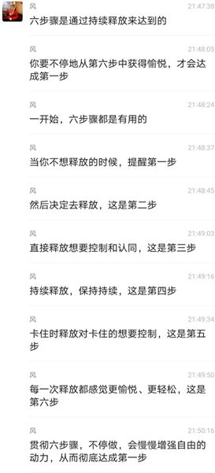

## The six steps

1)	Want freedom more than anything else.

2)	Decide you can do the method and be free.

3)	See all your feelings as expressions of three basic wants: the want of approval, control, and survival. Release the want of approval, the want of control, and lastly the fear of death.

4)	Release continuously.

5)	If you are stuck, let go of wanting to change the stuckness.

6)	Release more and more and become happier and lighter, until you move beyond happiness into imperturbability and freedom.

## 六步骤

1） 想要自由超过其他的一切。

2）决定你能通过释放获得自由。

3）你所有的感受都是三种基本欲望（想要被认同、想要控制、 想要生存）的表现形式，释放想要被认同、想要控制，直到 最后释放对死亡的恐惧。

4）持续不断地释放。

5）如果感觉卡住，释放“想要改变”卡住的情况。

6）随着越来越多地释放，变得更加快乐和轻松，直到你超越幸福状态，进入波澜不惊和自由的境界。

一曼注：此六步骤是在网上找到的可能接近原始六步骤的版本， 仅供大家参考理解，实操还是以风翻译的版本为主。
 

Again, the Six Steps are a key to everything.
 
再说一次，六步骤是一切的关键。

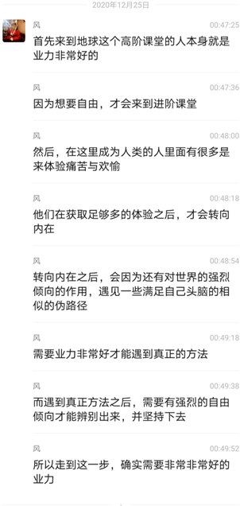
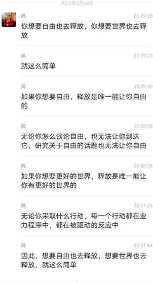

 
2020.12.31

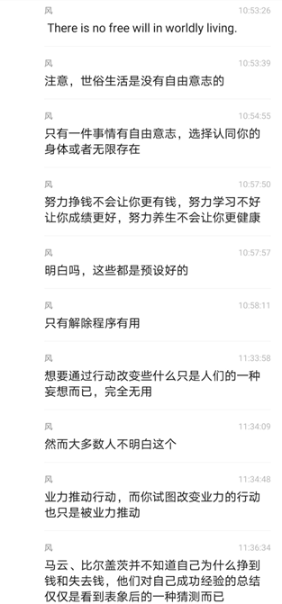
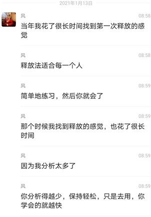
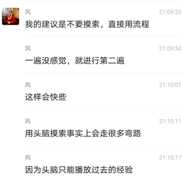

2021.1.11

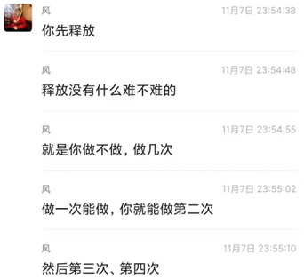
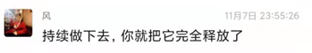
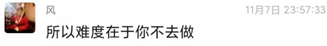

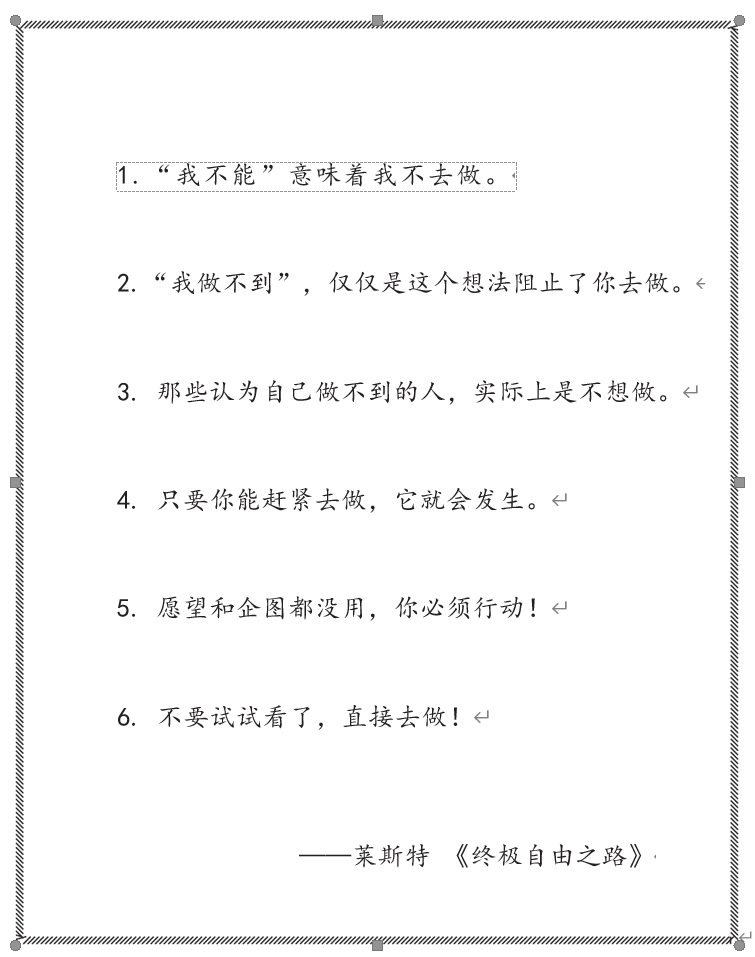

2020.12.7

2020.12.29

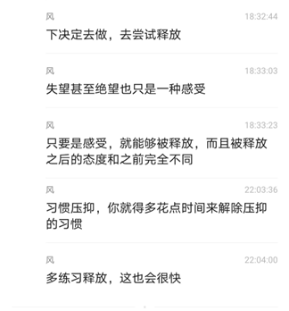
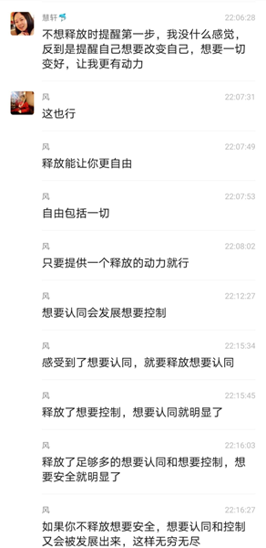
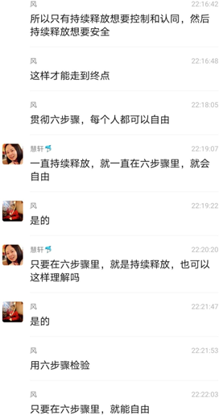
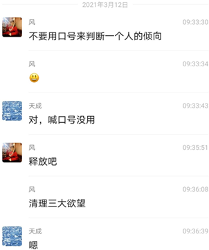
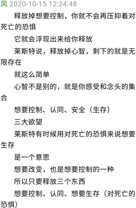

2021.3.11

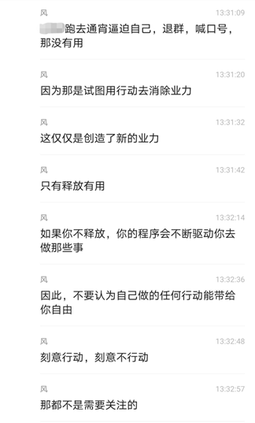
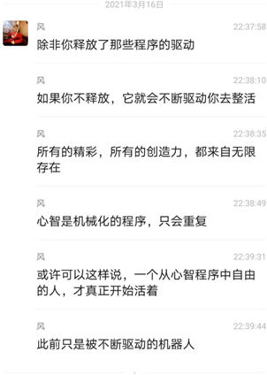

2020.10.24

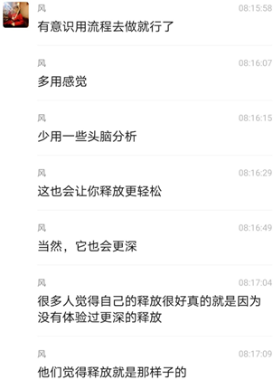
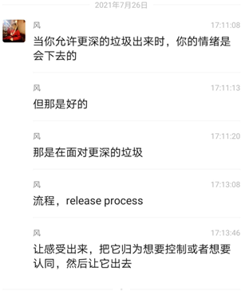
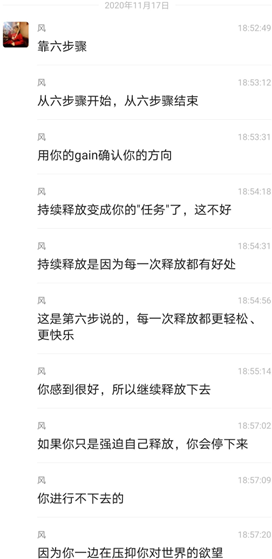

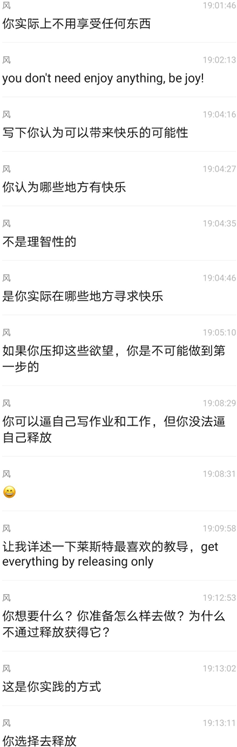
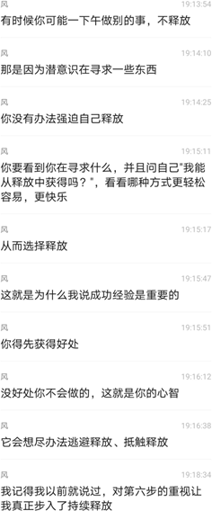
 
2020.12.23

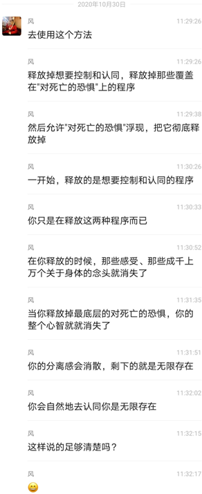
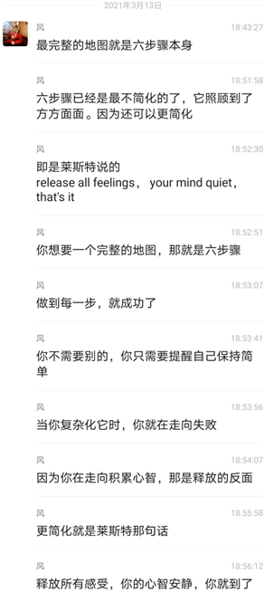

释放所有感受你的心智安静你就到了
——风 2020.3.13

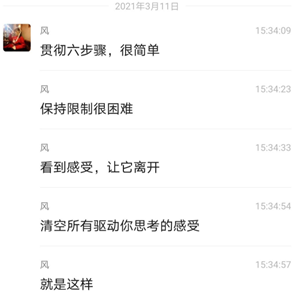
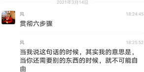

---

莱斯特的音频 keep it simple（讲到），他察觉到了想要认同，想要控制和想要安全，只是他第一个月只察觉到了想要认同，第二个月只察觉到了想要控制，第三个月才察觉到对死亡的恐惧。

所以他才说，如果他当时有六步骤，他会更快达到终点，" 你们现在有六步骤，所以你们应该比我更快 "。

如果你去做，就很简单。如果你不做，就不可能。简单，或者不可能（simple，or impossible）。

只需要几周，最多几个月，自由。

——风 2020.10.23

---

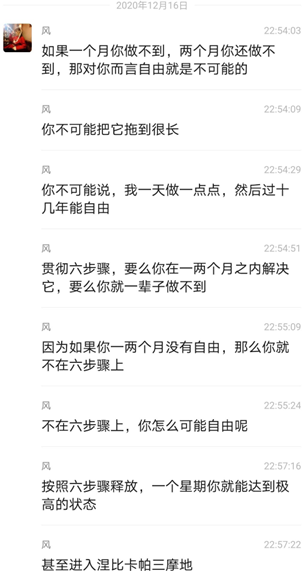
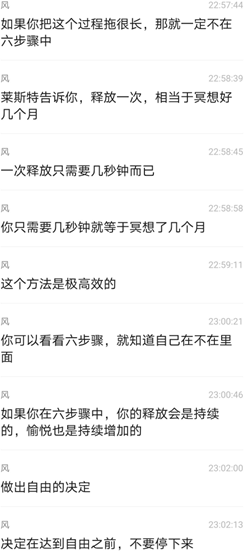

---

你只需要一个星期贯彻六步骤，来扭转过去强烈的习惯，释放就能像飙车一样向前进，重点是符合流程，贯彻六步骤，其他的我也没有任何要添加的了。

莱斯特所画出的地图路线清晰，只要继续走就行。

我记得在释放的第一个星期，每一次释放，会有巨大的能量涌出。

到后来，不仅不需要睡觉，每天也只需要一顿饭。在第二个星期，已经不需要进食了，甚至需要每天去天桥上跑一圈来消耗掉这些不断涌出的能 量，我是到最近几天才重新进了些食。

——风 2020.10.23

---

在第二个星期的时候，感受就会不断浮现出来， 然后离开，像波浪一样。

但是当我停下来时，瞥一眼六步骤，立即就会知道自己哪一步有问题，于是释放就又立即进行了。

流程并没有改变，只是它变得更直接了，操作更少了。

我感到自己一直在六步骤上，而这六步骤形成一个巨大的推动力，让释放持续下去。

领悟频繁发生，这时候你会被它们带着走，但只要继续提醒自己六步骤，就会继续释放，达到更高的高峰。

——风 2020.10.23

---

对死亡的恐惧是两大欲望、一切情绪和思想的起因。只要对死亡的恐惧没有彻底被释放，它就会不断发展想要认同和控制。

因为人们没有那么想要自由，所以很难自由， 他们会在一个极度美好的状态就停下来。

但无论是美梦还是噩梦，你都还在梦中。如果不超越梦境，你就会掉下来。

——风 2020.10.23

---

释放到后来，想要生存（对死亡的恐惧）会相当明显，而这是我现在的主要释放对象，在它之上的想要控制和认同，已经清理得非常稀少了。

说是“释放到后来”，是不是听上去像是十分遥远的事？但其实也只是一两个星期的持续释放而已。不要把它扩展到 " 年 " 的单位，因为它不需要。

这次只有一个目标，那就是自由。

——风 2020.10.18

---

2020.10.22

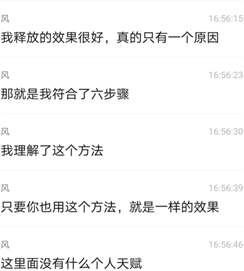
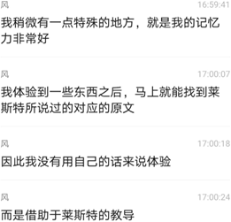
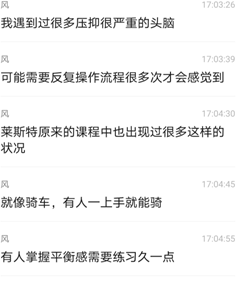
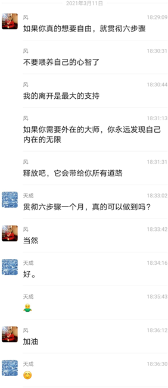
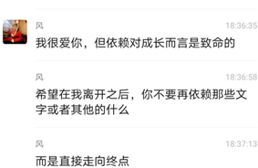

2021.3.16

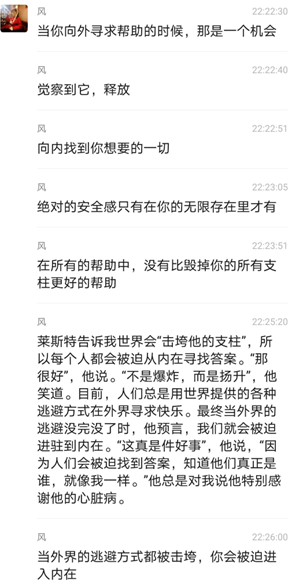
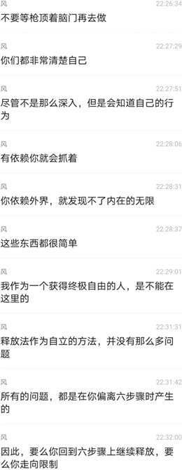
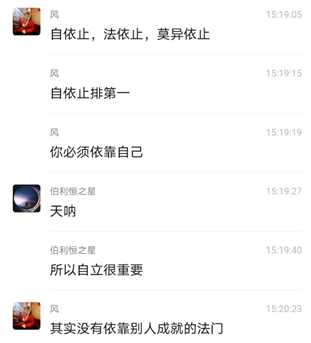
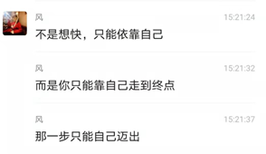
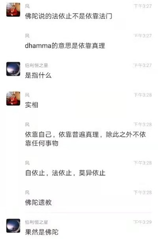

---

问：如果一个人对此很真诚但却没有成功，上师会向他伸出援手吗？

莱斯特：一个开悟的上师能提供最大的帮助，但如果你不自助，他也无法帮助你。

这是最重要的一点。如果你不帮助你自己，他就无法帮助你。

当你努力自助时，他会加入你，帮助你实现你已经准备就绪的觉醒。（When you try to help yourself, He joins you and helps you to a realization that you're
ready for.）

问：他会帮助我们？

莱斯特：当你准备好觉醒时，他会帮助你实现这一点。如果你敞开胸口，接受宇宙意识的注入，那是因为你已经准备好了。

在所有的帮助中，上师的帮助是最大的，因为他是过来人，他能引领你走上同样的道路。

——《终极自由之路》第三十二章 开悟——放下无意识

---

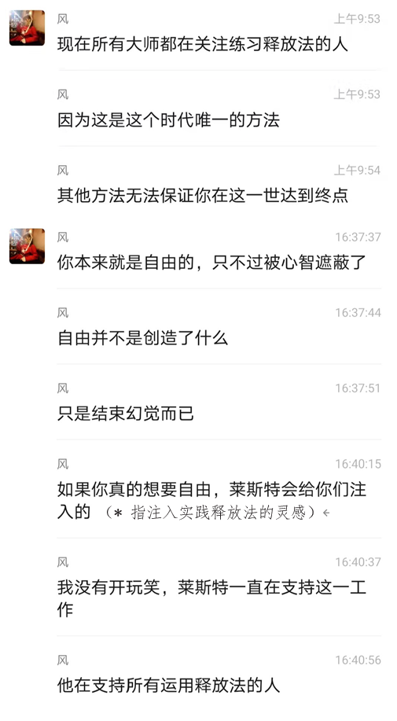
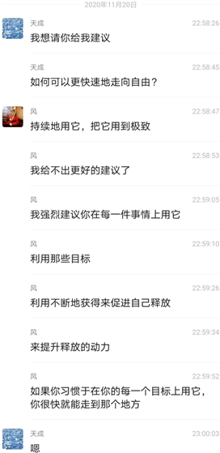
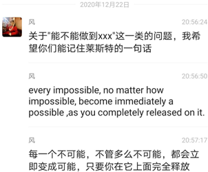
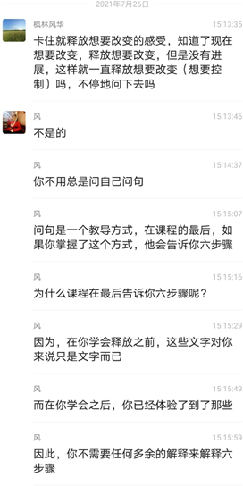
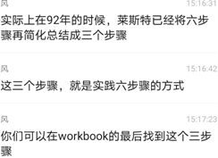
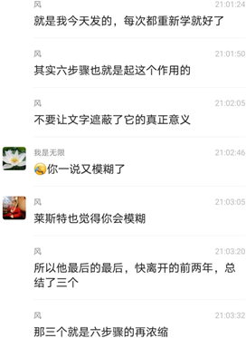

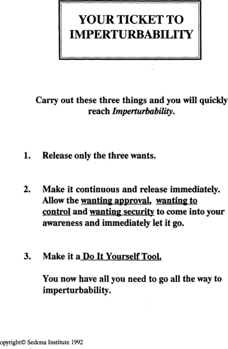

图片来自英文版 workbook 第 90 页
 

贯彻这三件事情，你将会迅速到达波澜不惊。

1.	仅仅释放这三个想要。

2.	让它持续不断并且立即释放。

允许想要被认同，想要控制和想要安全出现在你的意识里并且立即让它离开。

3.	让它成为一个自己动手去做的工具。

你现在已经拥有了你需要的一切去走完全程，到达波澜不惊。（去往自由的门票在这里了。）

---

让我来说一个重点：不要恐惧自由。

莱斯特经常和他的学生讲的，不要恐惧自由。从莱斯特的时代到现在，几乎每一个使用释放法却又不用到极致的人都在恐惧自由。

你之所以不去释放，是你害怕失去你的感受，你害怕会死，而实际上不会。

因此，莱斯特不断强调：你不会失去任何事，你只会失去你的痛苦。

你去做那些事，你向外寻找“大师”们的帮助，你应该知道你做的那些事看上去与自由相关，但实际上只是拖延。

包括，整理关于我的资料，包括进行分享。当你逃避向内看时，你会去整活，你会做一切事情——除了释放。

你的心智会告诉自己那对自由有益，或者对世界有益，但是那就是让你停下释放而已。

只要你停下释放，不管你做什么，那都是反方向。我不断强调这一点：谈论自由并不会让你自由，持续释放才会。

你要自己提醒自己：在六步骤上吗？
——风 2020.3.11

---

释放了感受，你就不会有被强迫驱动的思想，你可以自由地选择想你想要的，这会让你的世界就如你想要的呈现出来。

世界只是一个呈现而已，只是一个显示屏。当你想要改变画面时，砸显示屏是没有用的，只有释放有帮助。

外面什么都没有，只有你的一堆思想。是你创造了那个画面，没有例外。画面仅仅是思想而已，它不是其他的任何东西

把感受清空，你就没有思想，你的心智彻底安静下来。你会认出你是无限存在，然后再也不会失去这份知道，你可以随意放入感受和思想，但不会再被它运作，仅仅用于和人交流。

事实上只要你到达星光层时，你就看不到任何物质，只能看到明亮炽热的光。当你到达三摩地，体验到无限意识时，没有任何感受和思想。

自由之后你可以决定让身体走完它预设的，也可以直接离开，那是你的选择，完全自由的选择。

——风

---

在这条路上你永远不会失去任何东西，你只会拥有越来越多你真正想要的，直到你拥有全部。

除了我们给自己强加的绷带和伤痛，我们发现在灵性道路上永远不会失去什么。

你放下限制，放下痛苦，但你永远不会失去任何有价值的、美好的东西。

你知道，当你是无限时，你可以保有有限。你不会失去任何东西。

我们担心要放弃我们的身体、放弃我们的家族，但那不会发生。

那些开悟的人只是放下对身体和家族的执着，脱离执着所带来的束缚感，取而代之的是完全的自由。

（自由后）你可以做任何事，但你不会消失。

你永远都不再受影响，因为你已经拥有了不受搅扰的平静。

——莱斯特

---

问：我觉得你开悟比较容易，因为你之前没有太多先入为主的东西。
莱斯特：是的。我很幸运，因为对这个主题知道太多是种障碍。小我会用头脑的知识代替真实的体验。所以我在那之前对此一无所知，真的非常非常地幸运。

问：人们都认为这很难，但你当时并不知道这很难。

莱斯特：是的。但是这样一说，能够帮你看到你需要放下头脑知识所带来的障碍。我的经历可能激励你走上这条路。

我说：不要相信任何事。从零开始。将你的知识建立在体证的坚实基础上，一步步地去建立。每个人都必须这么走过来。

问：你拿不走别人的经验？

莱斯特：是的。你可以通过道听途说，但是唯一有用的却是你亲自体验而来的。

以开车为例。如果我说我看过有关如何开车的书籍， 我已经知道怎么开车了。我真的知道怎么开车了吗？不， 除非我真的开过车，否则我不会知道怎么开车。这个道理同样适用于这条道路，我们必须亲自去体验一切。

---

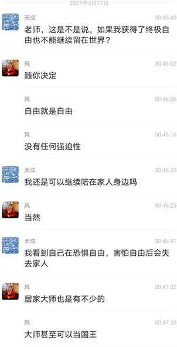
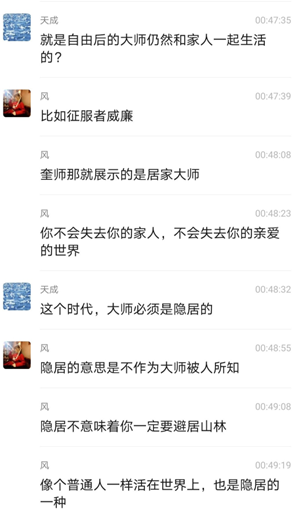

 
 

 
