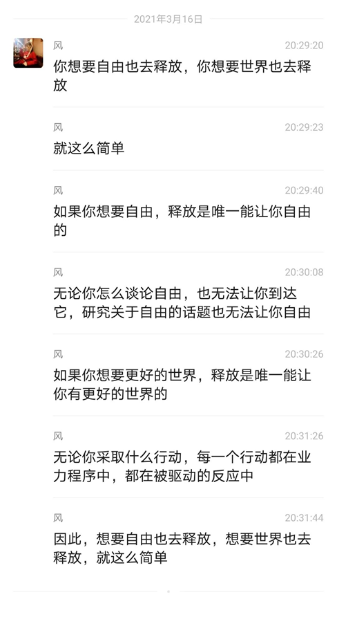

# 释放法对生活各方面的深远影响

释放法钻石岛 2021-11-28 20:02

收录于话题#释放书4个

 

”我研习了释放法，这是一段使我受益匪浅并极具启发性的经历。它赋予我全新的能量、自发的创造激情，以及对事物独到的见解。我向所有想改善生活的人们推荐这个方法。“

——医学博士 约翰·L凯梅尼

“释放法比市面上其他缓解因压力而导致生理反应的方法都更有效。在我对各种放松身心、减缓压力和知觉训练等方法的研究中发现，释放法以其绝对的简便、高效、明晰和立竿见影的效果而出类拔萃，它看似简单却蕴含着真正的力量。”

——大卫·霍金斯博士

你可以

在你生活中的每个领域

使用圣多纳释放法

  工作方面：

“多年来，我一直受困于转行和自己创业上。焦虑发作非常普遍，我总是陷入困境。这门课教我如何摆脱困境。焦虑和恐惧完全消失了，我相信我会有自己的事业。”

卡伦·弗里索尔  纽黑文

  健康方面：

“我有好几处身体疾病，包括偏头痛、憩室炎、痛风和严重的低血糖症，在上完这门课的一周后，我被安排做手术。但在开始释放后的几天内，需要进行手术的症状就消失了，而且再也没有出现过。我的其他身体问题也解决了。我相信这些良好的效果是由于使用该方法减少了压力。” 

大卫·霍金斯博士

实现目标： 

“圣多纳释放法帮助我变得更有条理，更专注于我的目标。我对被拒绝的反应已经大大减少了，因此，更容易达到销售目标，这产生了令人满意的结果。我相信我所学到的技术对任何一个做销售的人来说都是最有价值的。”

康拉德·E·伊姆豪斯

 解决问题： 

“我使用圣多纳释放法来帮助我处理在业务上面遇到的恐惧和优柔寡断的问题，扫除了阴霾障碍后，这种明显的清晰，帮助我做出了正确的决定。”

丹尼斯·C·奥沃奇  口腔外科博士

 

学习释放后

“学习了这门课程之后，我对自己的感觉更好了。我现在意识到过去的问题是由什么造成的，我该如何改正它们。我感到更轻松、更自由。我感觉到我的生活正在朝一个新的方向发展，我可以成为什么，可以获得什么，都是无限制的。我会向大家推荐这个课程。” 

约翰·里德林格，D.D.S.

”这是一个强大而神奇的过程，它远远超出了人们的头脑所能理解的范围。最终结果的美妙之处--正如我们的导师提醒我们的那样--有大量非常愉快的体验。“

凯特·桑德森  纽黑文市

“我终于找到了‘钥匙’。我现在明白了“改变你的思想——改变你的生活”的含义。知道我可以过上我们大家都想要的家庭生活，真是太令人激动了。”

金格·瓦特曼   凤凰城

“我走进这里，像一个非常小的人，在每个角落、每个人眼中寻找我自己的幸福。

然后我在我的内心找到了它。想象一下我有多惊讶。我打算今天走出这里并永远记住自己内心的力量可以完成我想要做的一切。

感谢圣多纳释放法向我展示了该往哪看——内在！”

桑迪·维尔库斯  凤凰城

“谢谢你！谢谢你！谢谢你！在过去的一个星期里，我已经能够通过释放法的教导和这个美妙课程的帮助来改变我的态度、情绪和生活。自1979年以来，这是我第一次感觉脖子和背部不再疼痛。我已经能够释放过去的记忆以及关于恐惧、愤怒和万念俱灰的情绪，这让我感觉棒极了。”

加里·n·妮基  凤凰城

“我一直在笑——日日夜夜!这太棒了。”

拉塞尔·布朗  凤凰城

“这种方法是一个非常有价值的工具，可以让你晚上休息得很好，醒来后感觉神清气爽、乐观向上。”

弗朗西斯·沃特曼  凤凰城

 

