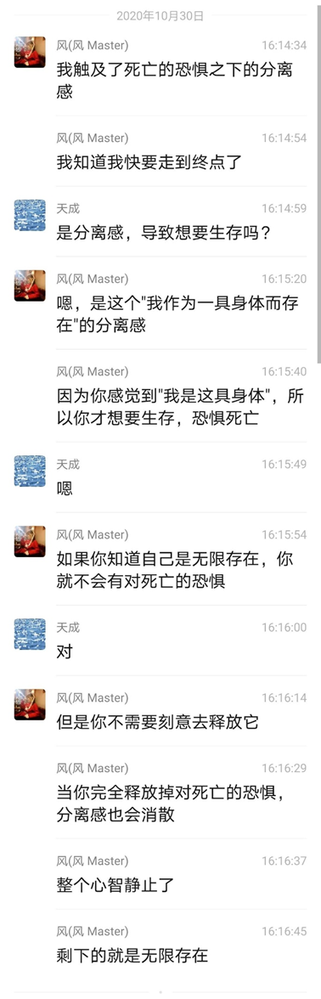
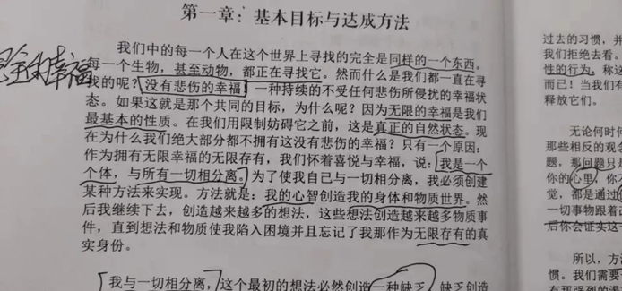
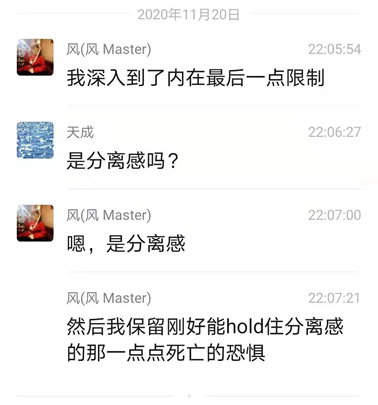

# 使用释放法到达终极自由的完整地图 3600字
2021-09-25  自由的捷径    <a href="http://www.360doc.com/userhome/17285885">资料来源</a>
  
**谈话一  2020.10.30**

风：  
去使用这个方法

风：  
释放掉想要控制和认同，释放掉那些覆盖在'对死亡的恐惧'上的程序

风：  
然后允许'对死亡的恐惧'浮现，把它彻底释放掉

风：  
一开始，释放的是想要控制和认同的程序

风：  
你只是在释放这两种程序而已

风：  
在你释放的时候，那些感受、那些成千上万个关于身体的念头就消失了

风：  
当你释放掉最底层的对死亡的恐惧，你的整个心智就都消失了

风：  
你的分离感会消散，剩下的就是无限存在

风：  
你会自然地去认同你是无限存在

风：  
这样说的足够清楚吗？

风：  
   

——————  
**谈话二  2020.10.30**  

风：  
另外就是'分离感'和'对死亡的恐惧'的问题

风：  
刚好roller翻译了那篇

风：  
我这几日在释放'对死亡的恐惧'后，遇到了那个separation

风：  
因此我认为对这个命题，需要再澄清得更加清楚些

风：  
因为我以前的论述（编注：风在确证六步骤之前），多少还掺杂了一些头脑的想象

风：  
我继续讲那个separation的话题

风：  
我持续释放了好几天的'对死亡的恐惧'

风：  
的确有一股'我是这具身体'的强烈感觉涌现了上来

风：  
但当我去接触它时，死亡的恐惧又发生了

风：  
'分离感'是最初的那个感受，它就是说'我是这具与无限存在相分离的身体'

风：  
如果你要自由，释放的目标只是想要控制、想要认同、以及对死亡的恐惧

风：  
当我接触到'分离感'之后，我看到了一点

风：  
如果我真的释放掉所有的对死亡的恐惧，它就会自行消散

风：  
因为是这个程序让它无法被你看清

风：  
因此，保持简单

风：  
释放覆盖在'NO.1程序'（对死亡的恐惧)上面的想要控制和认同

风：  
然后释放掉对死亡的恐惧

风：  
事情就结束了  
——————  
**谈话三  2020.12.1**  

问：  
风，莱斯特在目标与赢得那里说了第一个欲望是想要分离的欲望，
为什么在释放法没有把这个作为第一个欲望？

风：  
分离感

风：  
 

问：  
 

问：  

也就是说，释放对死亡的恐惧，同时也在释放分离感？

风：  
每一次释放都是在释放分离感

风：  
然而，当你处于这条底线去释放时，你可以在几个月内获得自由，持续释放将让你达到那儿。就你们现在所处的势头，你们能够去做到。随着你不断释放，你会去到高处（get high）。再从高处，你可以释放得更深并拉出对死亡的恐惧。当你放下了对死亡的恐惧，便会有一种更为强烈的痛苦出现——“分离感”。（When you're free of that fear of dying, there is a much stronger agony--the feeling of separation.）但因为你之前已经释放了太多垃圾，当你放下对死亡的恐惧时，你便有能力应付它并消除这个分离的感觉，于是你便就在那里（“There”）了。

风：  
释放掉对死亡的恐惧后，你会接触到分离感

风：  
这时候就是一个选择，选择成为无限存在，或者分离的个体

风：  
当你认同你的无限存在，你立刻就是了

问：  
释放掉对死亡的恐惧后，工作还没有完成？

风：  
完全释放掉就完成了

风：  
分离感涌现出来时，你还没有完全释放掉死亡的恐惧

风：  
 

风：  

这我之前和你讲过

风：  
如果你要hold住分离感，必须要保留一部分死亡的恐惧

风：  
否则分离感就会消散

风：  
当你完全清理掉死亡的恐惧，心智程序就完全清除了

问：  
分离感也被清除了，那就到达“我是一切”的状态了是吗？

风：  
无限存在

问：  
不再有分离的感觉？

风：  
嗯，不会再有'我是一个个体'的感觉

风：  
不会再感觉自己是一具身体

问：  
即使还在使用一具身体

风：  
嗯

风：  
你看着身体移动

问：  
你刚刚说，每一次释放都在释放分离感

风：  
是的

风：  
我们的存在构建了一个心智——“想象它是一个身体”。因此，你所做的一切，以及在你获得自由之前，我们将一直持续做的事情都是为了消除这种分离感。

风：  
分离感其实就是sense of ego

问：  
也可以说，释放的是个体感吗？我是一个个体的感觉

风：  
自我感

风：  
the way里面不用separation这个词

风：  
用的是sense of ego

风：  
自我感

风：  
每一次释放，你都是释放你的自我感

风：  
认识到上帝透过你行动

问：  
“不是我，而是天父通过我运作”
这是我之前经常喊的口号 

风：  
释放到它成为经验

问：  
嗯
你现在活在这种经验里吗？

风：  
基本上是

风：  
很少运用头脑来决定什么

风：  
不过这不是一种消极的感觉

风：  
这是一种美妙的至福的感觉  
——————  
**谈话四  2020.12.16**  

问：  
你现在还会不会看电影？

风：  
我不进行什么娱乐活动

风：  
除非我想要把自己拉下来

风：  
做事是可行的

风：  
但是当你看电影时，如果你的意愿是在电影上，你被电影情节吸引走，那就没法释放

风：  
因为你从电影情节获取快乐而不是从内在

问：  
风老师能知道我们这几个人是什么状态吗？

风：  
能知道

问：  
这群里谁能自由？

风：  
试试吧，不试试怎么知道呢

问：  
首先自由的人能在我们群里吗？

风：  
任何人都能自由

风：  
但是想要自由的人很少很少

问：  
风老师可以带我们集体释放吗？

风：  
我不带集体释放，这不会有帮助

风：  
真正的帮助是把释放法作为一个自立的方法

风：  
一个人不可能通过依赖他人达到自由

风：  
这是背道而驰的

风：  
向外寻找力量的企图让人发现不了真正无限力量的来源

风：  
That's it

风：  
 

问：  
你再给众生开发出一套更简单的可以自由的方法呗

风：  
方法共有112条

风：  
在不同的时代会有大师揭示不同的方法

风：  
在这个时代最适宜的方法就是释放法

风：  
因此大师们纷纷在1952年左右离开

风：  
尤其是尤迦南达，在1952年3月7日选择离开

问：  
112条。有没有不是自立的

风：  
皆需自立

问：  
哦哦，我感觉这时代让人自立很难。
比如，我要怎么帮助别人。

现代人都看结果。除非我先自由了。

风：  
真正地帮助别人是释放你的自我感

风：  
你会从更高的角度知道怎样做对某个人是最好的

风：  
而不仅仅停留在表面的帮助

问：  
这个自我感是？

风：  
sense of ego

风：  
就是你的心智

风：  
心智是围绕着自我构建的

问：  
我们用释放的同时，在用上莱斯特在爱的力量那本书里的爱的方法是不是更快些呢？

风：  
不是

风：  
事实上莱斯特在音频里告诉过你

风：  
他用了三个月，这三个月里面有探索的时间

问：  
一个月我是有点不相信

风：  
他说如果他一开始就知道六步骤，他只会花一个月或者更少时间

风：  
简单，或者不可能

风：  
如果一个月你做不到，两个月你还做不到，那对你而言自由就是不可能的

风：  
你不可能把它拖到很长，你不可能说，我一天做一点点，然后过十几年能自由

问：  
那就是说自己根本不想自由，所以才做不到

问：  
为什么不能拖太长时间？

风：  
贯彻六步骤，要么你在一两个月之内解决它，要么你就一辈子做不到

风：  
因为如果你一两个月没有自由，那么你就不在六步骤上

风：  
不在六步骤上，你怎么可能自由呢

问：  
单纯用六步骤，不用结合爱的练习吗

风：  
是的，六步骤是完整的地图

风：  
你不需要再给它添加别的东西了

问：  
你知道我们每个人的状态，我释放的到底对不对，天天释放不完

风：  
肯定是不对的

风：  
按照六步骤释放，一个星期你就能达到极高的状态

风：  
甚至进入涅比卡帕三摩地

风：  
如果你把这个过程拖很长，那就一定不在六步骤中

风：  
莱斯特告诉你，释放一次，相当于冥想好几个月

风：  
一次释放只需要几秒钟而已

风：  
你只需要几秒钟就等于冥想了几个月

风：  
这个方法是极高效的

问：  
我们错在哪了呢？一天释放都不能到达一次释放的效果

风：  
你可以看看六步骤，就知道自己在不在里面

问：  
第一步肯定没有

风：  
如果你在六步骤中，你的释放会是持续的，愉悦也是持续增加的

问：  
第二步，这个自由的决定是决定自由还是决定释放？

风：  
做出自由的决定

风：  
决定在达到自由之前，不要停下来

风：  
佛陀坐在树下时，决定'不找到解脱之道绝不起座'

问：  
现在我们的程度不是可以先忽略第一步和第二步吗？等到了预流果时，才会用到这两步吧？

风：  
不是忽略第一步和第二步

风：  
第一步的完全达成，需要预流

风：  
但是你如果不主动运用第一步和第二步，你也不能达到预流

风：  
六步骤是需要你主动贯彻的

风：  
然后当你彻底达成第一步，后五步就会带着你走

问：  
那果真有时不是那么想要自由

风：  
所以对你们来说最具有实践性的就是莱斯特最推荐的教导

风：  
get everything by releasing only

风：  
因为你总是有想要

风：  
决定通过释放获得每一个想要的事物，也会让你不停地释放

问：  
什么意思？

风：  
在到达终点之前你都会有想要的事物

风：  
everything means everything

风：  
一切就是一切

风：  
你仅仅通过释放获得想要的一切，这也能让你贯彻六步骤

风：  
拿起其中任何一个指导，你都可以自由

问：  
我们得到的一切，都通过哪些地方显化过来

风：  
任何地方

风：  
你先做到以物质世界的方式获得想要的，然后到达那个莱斯特说的'物质化和反物质化'的阶段

问：  

物质世界的方式是指什么？

风：  
就是莱斯特展示给你的那些，想要的通过毫不费力的方式到来

风：  
Micheal达到了这个阶段

风：  
但是莱斯特说他没有继续

风：  
如果继续下去，他就可以物质化和反物质化

风：  
让物质瞬间出现，瞬间消失

风：  
只需要变化心智中的图像，物质就立即发生变化

风：  
到达这个阶段，还需要再释放下去

风：  
完全超越物质世界、星光界、因果界的业力

风：  
到达无限存在

问：  
风今天来这个群里，也是有原因的吧

风：  
我只是把完整的地图再说一遍

问：  
谢谢，又清晰了很多。

问：  
真是没有老师指引，不知道多少世才能达到，都在弯路上兜兜转转。

风：  
不客气

风：  
保持简单，贯彻六步骤。
    
——————  
**谈话五  2021.1.2**  

风：  
在释放法中，贯彻六步骤就能达到终点

风：  
不贯彻六步骤就达不到终点

风：  
做，或者不做

风：  
就像莱斯特最后对Ralph说的那样

风：  
“你要么做，要么不做
我希望你去做”

风：  
简单，或者不可能
——————

风：贯彻六步骤，一到两个月就可以走完全程，到达终点。
