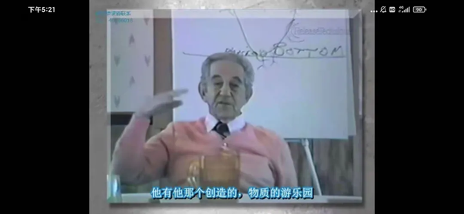
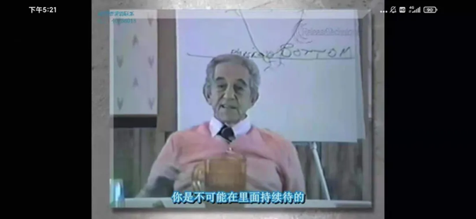
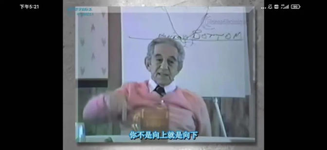
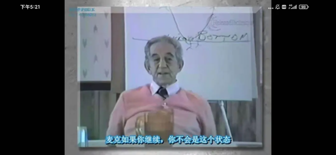
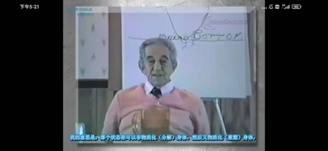
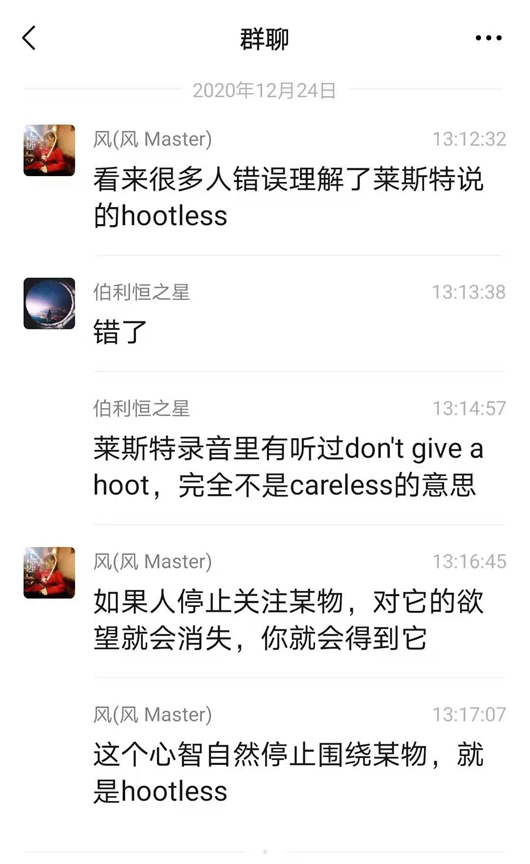

# 对目标完全释放后，你就会知道它已经是你的了，接着你会自动hootless，然后就会显化2020.12.24
通往自由的捷径 2021-07-09 08:  55

**对话  2020.12.24**

问:    
我想问一个问题，怎样是释放彻底，是对一个目标释放到不管目标实现与否都不在意吗？

风:  
释放到完全拥有的感觉后，继续释放

风:  
接着你的心智就会自动离开这个目标，不会再想到它

风:  
然后它就会显化

问:  
风先生，能说说瞬间显化的核心是什么吗？

风:  
 

风:  
 

风:  
 

风:  
 

风:  
 

问:  
已经实现的感觉是要伴随很高的喜悦，还是一种直觉的拥有

风:  
当你知道你已经拥有了，你不需要确认

风:  
然后你会自动停止关注它

风:  
接着你就会得到它

问:  
我看到教科书和视频上是要双面释放

风:  
你可以释放关于它的attachment和aversion

风:  
释放时依然是三大欲望

风:  
每一次释放都会让你感觉更好

风:  
你就会知道它已经是你的了

风:  
接着你会自动hootless

问:  
实现的速度完全依赖于释放的速度是吗

问:  
还是说世界会按照它的步骤调整显化

风:  
会在最合适的时候显化出来

风:  
不过这个只是物质世界的迟钝性

风:  
当你能够显化之后，莱斯特鼓励你达到物质化和反物质化

风:  
那个就是立即的

问:  
物质化和反物质化是如何的

问:  
这个立即不也是在物质世界吗

风:  
嗯

风:  
但你超越了物质世界的限制

问:  
为什么这个就没有延迟，之前目标就延迟

风:  
因为你达到星光界了

问:  
物质化和反物质化怎样理解啊？反物质化是什么意思？就是超越物质世界的限制了就是反物质化吗？

风:    
 

风:  
物质化就是让物质瞬间出现

风:  
反物质化就是让物质瞬间消失

问:  
先实现所有目标，然后继续释放，能量会达到星光界，于是可以在这个物质界物质化和反物质化？

风:  
是你的意识状态达到了星光界

问:  
这是赤裸裸的控制呀

风:  
Goals and winning 你必须赢得目标（链接点击可看）

风:  
【正如我们所知，控制并不是一个不好的词，也不是一件坏事情，“想要”控制才是。当我们自由的时候，我们只需轻松的意念就可以完全掌控整个宇宙。当你变得自由，你的心智是安静的，没有任何想法，所以你放在头脑里的任何一个想法都会凝聚实现。但是目前你的心智可能被成千上万的想法所困扰，而所有的想法都与AGFLAP有关。】

风:  
你要达到完全掌控宇宙的程度

风:  
你要先掌控物质，然后掌控心智，做心智和物质的主人

风:  
这样，你就能发现自己的无限本质

风:  
莱斯特的音频视频都有答案

问:  
就是在用目标释放法的时候需要视觉化吗，视觉化目标实现的场景

风:  
不需要刻意去视觉化

问:  
莱斯特视频1-莱斯特1984年加强训练班视频 1（链接点击可看）

问:  
【*当我们完全地释放后，你知道你在完全释放之前是不会放弃的】

这句话释放之前是不会放弃的是什么意思呢？

问:  
这句翻译我一直认为是错的

啊我想起来了

英文是：you don't give a hoot

也就是完全不在意

翻译是不会放弃

他听成give up了

风:  
你听到的是对的

风:  
他的断句错误了

风:  
every impossible, no matter how impossible, become immediately a possible ,as you completely released on it.

风:  
这是一句

风:  
You know you completely released on it when you don't give a hoot

风:  
每一个不可能，不管多么不可能，当你对它完全释放之后，都会立即变成可能

问:  
这个翻译过来是不在乎？

风:  
当你完全不关注它的时候

风:  
 

风:  
莱斯特音频中解释过这个don't give a hoot

风:  
意思就是，当你完全释放之后，你的心智会彻彻底底对它失去关注

问:  
原来是这样呀

问:  
那这样，验证岂不是很难验证到

风:  
不会

风:  
当你彻底失去关注之后，很快就会显化

问:  
那就是当自己释放到完全不关注目标的时候

风:  
嗯，你会完全知道它实现了

风:  
然后你会自然不关注它

风:  
所以我才和你说，你要释放到完全知道它实现，然后继续释放

问:  
这时候还要延迟吧

风:  
这种延迟没有关系

风:  
其实已经实现了

风:  
胶片已经放进去了

风:  
只是投射到荧幕上的时间

问:  
都完全知道它实现了，为什么还要继续释放啊？不懂

风:  
继续释放你才明白自己是不是真的完全释放

风:  
有时候你会把不完全的知道当成完全知道

风:  
事实上你真的完全知道时，你的心智会自然把它完全释放，不会再关注它

问:  
继续释放怎么操作？怎么问句？

风:  
嗯，只要有感觉，就继续释放

问:  
好的，明白了

---
相关内容链接：  

[重视目标以及制定目标的一个关键](重视目标以及制定目标的一个关键.md)

[与大师的对话 | 莱斯特的教导要重视外部确认以及到达自由的全过程](与大师的对话：莱斯特的教导要重视外部确认以及达到自由的全过程.md)S

[通过实践“仅仅通过释放获得一切你想要的”，这样就会做到六步骤](./../通过时间仅仅通过释放获得一切你想要的，这样就会做到六步骤.md)

[如何可以快速经验性地达成第一步？](如何可以快速经验性地达成第一步？.md)
