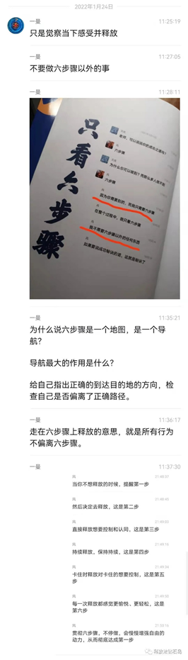

# 《风谈六步骤》连载2丨我如何做到

原创 一曼 释放法钻石岛 2022-02-10 16:08

收录于话题#《风谈六步骤》连载13个

❀ Hi ~ 欢迎登岛 ❀—  当你走向内在，你会发现所有的幸福都在那儿 —

∞

带着问题去看书

主动学习

是的，你可以带着以下几个问题去看《风谈六步骤》全书，最后把如何贯彻六步骤的答案记在下面以提醒自己。

1）如何做到并达成第一步？

2）如何做到第二步？

3）我对第三步使用得如何？我有制定要达成的目标或用莱斯特的自由指引来让自己随时觉察感受并释放吗？

4）如何做到第四步？

5）我对第五步使用得如何？

6）我是否有用第六步检验自己的释放，我是否有体验到第六步？

*看完此书后，请将你日常提醒自己释放所用的六步骤实践版写下来（《风谈六步骤》第27页有参考），在遇到头脑混乱，不知道该如何释放，释放感觉不对，停下释放等情况时，用这一页来提醒自己，将自己拉回到正确的方向上。

写完后，你也可以再抄写一张，贴在常见的地方。

 

一曼：关于六步骤的实践版流程，我给自己写过很多版，下面两张图片是其中曾经自用的两版，供大家参考。建议大家根据风对六步骤的分享制作一份适合引导自己释放的简化实践版，方便日常提醒自己。

 

为什么要把引导自己释放的流程写在纸上提醒自己？

1. 我们的大脑不喜欢模棱两可，不喜欢不明确的事情。当我们想要释放，却不清楚流程时，大脑会利用这个模棱两可的机会，劝你去做一些好像更容易的事情（比如打开手机刷视频）。有的时候我们并不是缺乏动力，而是缺乏做某件事的明确步骤。把清晰的引导释放的流程写在纸上，消除对于如何实践释放的模糊性，让自己直接照着流程做，可以大大提高专注度与行动力。

2. 不要低估我们逃避面对感受的惯性倾向，在未进入稳定的持续释放状态前，我们往往很容易释放到感觉不错时就停下来。六步骤实践版的流程可以提醒我们继续释放，不要找机会轻易停下来。

3. 当我们因为某些原因停下释放很长一段时间时，突然想释放却好像不知道从哪里开始了，那么之前已经写好的流程就可以迅速告诉我应该怎么做，把我们拉回到六步骤上重新开始释放。

P.S.：大家可以购买下面这种带透明插页的文件夹（路边文具店、淘宝有很多款式），用来收集自己日常所写的关于释放的资料（流程、收获、重要提醒），归整到一起，方便随时取用。

 

 
