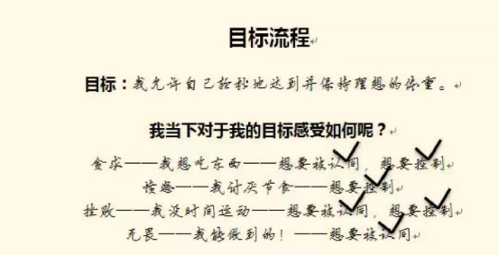
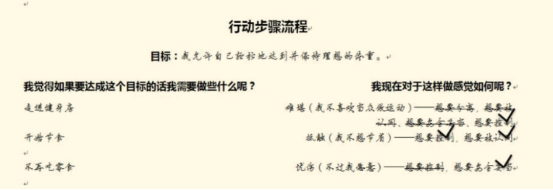
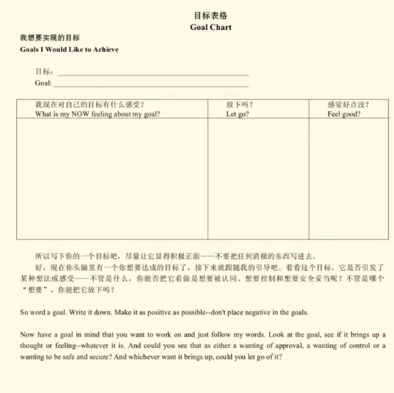
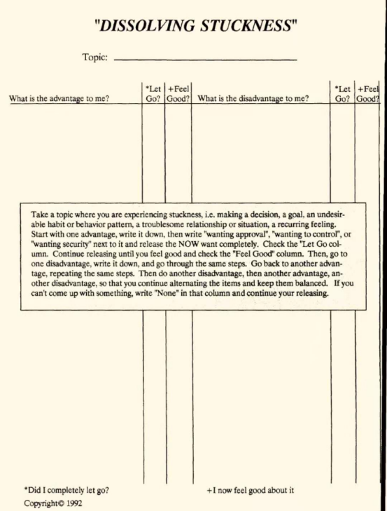
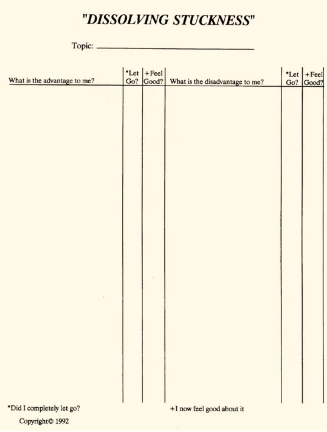

# 通过实践“仅仅通过释放获得一切你想要的”，这样就会做到六步骤

原始圣多纳释放法 2021-04-02 16:14

风：实践“仅仅通过释放获得一切你想要的”，把六步骤放在身边，可以用目标表格，卡住了记得释放想要控制，这样就会做到六步骤。

把你想要的写下来，然后你看看它有没有想要控制、想要认同、想要安全。

用这两个，写下你的目标，然后写下你对目标的第一想法或者第一感受，然后看看它是来自哪个或者哪些基本欲望，写下来，释放这些欲望，释放掉一个就打一个钩。

 

“目标流程练习会让你学到一种新方法来做释放。

第一步：在一张空白纸的顶上写下你的目标，要重新措辞过的那个版本。

第二步：读出你的目标，默读或是大声念出来都可以。在目标之下写出头脑中浮现的第一感觉，第一想法，任何与之相关的东西。

第三步：问问自己，那些感受或是想法背后隐藏着怎样的欲望。你可以用以下问题来引导：它（指那种感受或是想法）来自于想要被认同的欲望吗？来自于想要控制的欲望吗？还是来自于想要安全妥当的欲望呢？在旁边简单标注一下，可以用缩写。如果不止一种欲望被搅起来了，就都写下来吧。

第四步：把你写下的那些欲望都释放掉。就问自己，我能否把想要被认同/想要控制/想要安全的欲望放开呢？搞定一个欲望，就划掉它或在旁边打勾。

第五步：重复2~4步，直到你对目标的感受变成无畏、接纳与平和。当你感受到这些高阶能量的时候，就意味着你已经移除了一层与这个目标相关的限制。现在你有三种方式来进行第六步。

第六步：第一种方式，继续重复上面这个流程来消除更多限制；第二种方式，暂时把这流程放到一边然后该干嘛干嘛，当你偶尔想到这目标的时候，尽可能地释放【一个小小的警告：在你停止这个流程之前，最好确保你已经达到无畏、接纳或平和这三个阶段之一。否则你就会一直被这不是很完整、很理想的结果困扰着。此外，你可能也不愿意再回到那些低阶能量中释放了。】；第三种方式，继续进行目标流程，也就是进行下面的这个行动流程。”

 

风：海尔这个描述基本符合原始教导，只有第六步是错误的。

 

“行动步骤流程算是目标流程的补充，它会帮助你放开更多的内在限制，不管是情绪上的、心理上的、还是某种行为障碍……只要是那些阻止你采取行动、降低你追求目标的效率的东西，统统都放掉。此外，这个流程还会帮助你挑拣出真正有助于追求某个目标的行为，帮你节省许多时间与精力。

关于实现目标、达到梦想，我们许多人都有逃避的冲动，因为我们会预想自己必须要为此做许多不喜欢的事。当你在行动步骤流程中释放的时候，你会发现自己能够释放掉许多对某些行为的抵触，或者发现有些行为其实不是必需的，而是你自己构建的心理障碍。

好，现在请你把释放日志翻到新的一页。

第一步：在一张空白纸的顶上写下你的目标，要写完整，最好不要简略，不用缩写。

第二步：默读你的目标，然后问自己：我觉得如果要达成这个目标的话我需要做些什么呢？然后，另起一行写下所有你能想到的答案，有些会直接跳出来的。当然，你也可以选择每次只写下一件事，这样分开来做。

第三步：在那件事旁边写下与之相关的任何想法或感受。

第四步：问问自己，那些感受或是想法背后隐藏着怎样的欲望。你可以用以下问题来引导：它（指那种感受或是想法）来自于想要被认同的欲望吗？来自于想要控制的欲望吗？还是来自于想要安全妥当的欲望呢？在旁边简单标注一下，可以用缩写。如果不止一种欲望被搅起来了，就都写下来吧，可以用简写节省一些空间。

第五步：把你写下的那些欲望都释放掉。就问自己，我能否把想要被认同/想要控制/想要安全的欲望放开呢？搞定一个欲望，就划掉它或在旁边打勾。继续重复、释放，直到你对每个行动步骤的感受变成无畏、接纳与平和。

第六步：重复2~5步，直到你搞定了所有写下的行动步骤。时间紧的话，你可以先完成一部分，之后再提醒自己来完成它。但是最好确保自己对每个行动步骤的感觉都达到无畏的阶段。

第七步：等待合适的时机采取行动。另外，不管是行动前、行动中，还是行动后，都不要忘了释放哦。”

 

风：To do list的释放，第六和第七步是错误的，都加入了自己的东西。实现目标需要释放到心智自然离开目标，不再想起，所以持续释放就对了。你要释放到感觉到完全拥有，然后心智自动离开目标。

用到第五步，但是第五步要稍微改一改。不是释放到cap就停下来，而是释放到感觉完全拥有，然后心智自然停下对它的关注。海尔以前天天释放到cap就停下来，所以来回折腾，他写书也把自己错误经验加进去了。 

不过to do list可以作为一个辅助，它的本意不是让你去行动，而是让你去释放那些你认为自己必须做的行动。比如你觉得要节食才能减肥，你就要释放节食这个行动背后的基本欲望。你觉得要拿到钱必须办张银行卡，要买房子必须去看房，等等这些限制性的想法。

 

问：先释放这个，然后再释放to do list吗？还是两个一起释放？

答：一起释放吧，释放到你不需要做任何事，它此刻就是你的。但凡还有一丝怀疑，就继续释放。释放到完全相信，也继续释放，直到心智自动停止关注，或者干脆点，释放到它掉到你膝盖上，这样改你更能理解。
 

再看一下你的目标，看它唤起了怎样的想法或感受。不管是什么，请写下来。你能把它看做是想要被认同、想要控制和想要安全妥当吗？你能把这些欲望都放下吗？再次看一下你的目标，看它唤起了怎样的想法。这激起了你想要被认同、想要控制和想要安全的欲望吗？你能把这些欲望都放下吗？再看一下你的目标，你觉得实现它看上去是更有可能了还是更不可能了？如果你真的坚持做释放了，就会发现是更有可能了。在你看自己的目标的时候还产生了怎样的想法或感受呢？那让你觉得想要被认同、想要控制或是想要安全吗？你能把这些“想要”都放下吗？再看一下你的目标。你还产生了怎样的想法呢？你能把它们都视为想要被认同、想要控制和想要安全的欲望吗？你能把这些欲望都放下吗？

现在，再看看你的目标，它引发了你的某些想法或是感受吗？不管是什么，你能把它视为想要被认同、想要控制和想要安全的欲望吗？你能把这些“想要”都放下吗？再次看看你的目标，看它在你脑海里引发了什么，那是否等于想要被认同、想要控制和想要安全的感觉？不管是怎样的感觉被激起了，你能放下吗？现在，你要持续对这个目标做释放，直到你感觉“我拥有它了，它现在就是我的了”。然后你继续重复以上的过程，继续对此目标做释放，直到它掉到你大腿上——直到你真真切切地把它握在手里（不是认为你已经拥有它了，而是真的把它握在手里了）。如果你真的保持对一个目标的释放，并且那个目标真的是你心之所向，那么它很快就会到来的。 

如果你没能实现目标的话怎么办？
如果你在同一个目标上释放了两个星期依然没有效果的话，我建议你对“完成这个目标”做贪爱嗔恨练习。你也许会发现，其实在潜意识里，你没那么想要这个结果，这就是为什么它没有很快发生。但是如果你真的决心要实现它的话，它也会到来的。莱斯特认为目标是非常非常重要的。我建议你每天都在一个小本上写下自己的目标。我有时会同时进行四五个目标，我会每天都对它们做释放。然后，当我真的实现了目标时候就把它圈出来，写上“我成功了”。这样的话当我之后翻到这页时就能看出我实现了什么，没实现什么。如果有哪个目标我没有成功实现，我就坐下来做“我为什么会让这种事发生”的负责任练习，然后我就会明白过来了。

我问自己说，“我为什么没有实现这个目标？”然后我试着去释放，或者对“完成这个目标”做好处坏处的练习。然后我通过释放就能够明白自己正在做什么。很多时候，我们向往某些东西，为之奋斗，但是又明白自明白自己不可能成功，所以当我们受阻时我们会说，“我就知道”。所以确保你这种目标做了视其深度与强度而定的贪爱嗔恨练习和好处坏处练习。然后对其做释放，就能对它有更清楚的了解。我保证，随着你不断地释放，它会从天而降的。你一定要证明给自己看，不要听我这么说就相信，要去证实给自己这是对的。也不要只做一次，要重复做。

问：这段话是拉里的吗？

风：是的，拉里对目标的讲述是完全正确的。

 

问：这里说的好处坏处的练习，也是去释放吧?

风：就是workbook里的这个，好处坏处练习。这件事对我有什么好处?有什么坏处?写下来，看到它背后的基本欲望，然后释放，这就是好处坏处流程。

Go All The Way:  
我有个疑问

刚刚尝试了一下纸面上的释放

然后写到后面我发现我不会释放了

就是本来我当下对目标的感受是想要改变，我觉察得很快，但是我写的又很慢，当我把我的思路捋清了，写完了以后，那感受就跑了。

我怎么办？

 

风:  
先写下来

然后，问自己:我还有对它的想要控制吗？

 

Go All The Way:  
继续写吗？

 

风:  
先写几个

然后一个个对着释放

 

Go All The Way:  
写下来感受就跑了

 

风:  
不要紧

你觉得感受跑了，但你的感受是cap吗？

 

Go All The Way:  
不是

 

风:  
那是什么？

你可以写下来这个感受

 

Go All The Way:  
我就是觉得我写下来的那个感受跑了，但是还有其它的感受

 

风:  
没事，有一个算一个

 

Go All The Way:  
好像又可以了，我就写一下我这个感受，能释放了

而且我释放完这个这两个感受，一下子心情就愉悦了

 

风:  
嗯，有一个算一个

 

Go All The Way:  
效率太高了

还差一点，还有那个feel good，这个好像没有做到，还有继续释放吗？

刚刚应该算是做到了Let  go

风:  
继续释放

 

Go All The Way:  
我这个页面好像也没有写这两栏

继续释放我刚刚释放的，还是再写新的？

 

风:  
你觉得那个释放掉了就写新的

 

Go All The Way:  
怎样算是释放掉了？

 

风:  
感觉好

你不再感到想要控制或者想要被认同

而是感觉能控制，感觉有认同

或者有安全感

确定那个想要被释放掉了

 

Go All The Way:  
是对这个目标的感受，还是对我刚刚写下释放的那一条呢？

 

风:  
就那一条就行

那一条释放掉了就打钩

目标背后有很多感受

一一释放即可

 

我是无限:  
目标可以直接这样写吗？

“我已经有了2350万人民币或者更多。”

 

风:  
“我允许自己……”好一点

你让它自行发生就行了

 

我是无限:  
这样吗？“我允许自己已经有了2350万人民币或者更多。”

 

风:  
可以

 

我是无限:  
感觉自己这些目标好奢侈

非常的肆无忌惮

 

风:  
先选几个释放一下

 

我是无限:  
好

 

风:  
还好，你只是限制性想法太多

所有限制都可以被释放

不过你可以用表格来check自己处在哪里，还有多少限制要释放

只要还有限制性的想法或者感受，就释放它

 

Go All The Way:  
有时候我会一下子就觉察到是什么感受，前面那些思想，念头就会来不及冒出来，这样能释放吗？还是我要停下来捋一捋思路？

 

风:  
感受来了可以释放完，然后再check你的表格

注意表格只是辅助

它是让你释放更清晰的

让你明白自己还有多少限制要释放

 

Go All The Way:  
好的，我继续释放看看

有时候我释放了这个这一条的一个想要控制，一会儿又有想要控制冒出来了，我就继续这样写着释放吗？重复释放同样的感受，同样的想要控制？

 

风:  
可以

或者你确保释放掉了再打钩

表格不要太完美主义，这是想要控制

钩错了重新写就是了