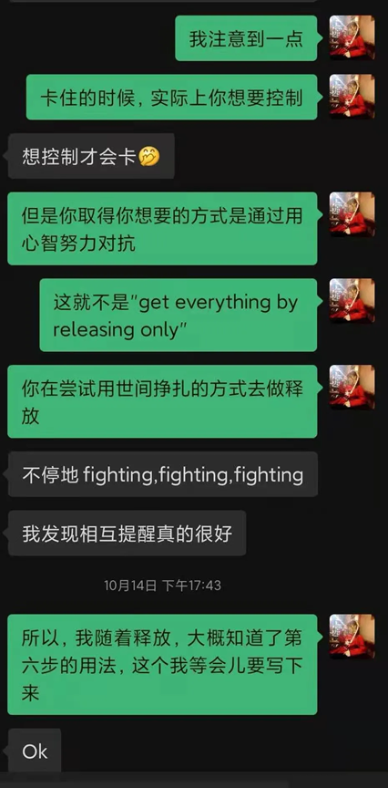

# 风对“六步骤”的谈话（三）2020.11.17
通往自由的捷径 2021-03-05 09:19
谈话日期：2020.11.17

风：
靠六步骤。从六步骤开始，从六步骤结束。用你的gain确认你的方向。

持续释放变成你的"任务"了，这不好。持续释放是因为每一次释放都有好处，这是第六步说的，每一次释放都更轻松、更快乐。你感到很好，所以继续释放下去。

如果你只是强迫自己释放，你会停下来，你进行不下去的，因为你一边在压抑你对世界的欲望。

我的方法就是我不停确认自己的gain，以及自己的方向。

譬如她刚刚要听音乐，她想从音乐里面获得什么？那么这个从释放中能不能获得呢？可不可以试一下呢？

不断确认自己的收获就可以让你保持持续释放。

如果你说"我行，我必须释放，我不能听音乐"，这不会奏效，因为你潜意识的一个方向是听音乐，被你压抑进去了。你显意识和潜意识在拉扯，你不去看它，这不会成功。

你实际上不用享受任何东西。you don't need enjoy anything, be joy！

写下你认为可以带来快乐的可能性，你认为哪些地方有快乐，不是理智性的，是你实际在哪些地方寻求快乐。

如果你压抑这些欲望，你是不可能做到第一步的。你可以逼自己写作业和工作，但你没法逼自己释放。

让我详述一下莱斯特最喜欢的教导，get everything by releasing only（仅仅通过释放获得一切）

你想要什么？你准备怎么样去做？为什么不通过释放获得它？这是你实践的方式，你选择去释放。

有时候你可能一下午做别的事，不释放。那是因为潜意识在寻求一些东西。你没有办法强迫自己释放。

你要看到你在寻求什么，并且问自己"我能从释放中获得吗？"，看看哪种方式更轻松容易，更快乐，从而选择释放。

这就是为什么我说成功经验是重要的，你得先获得好处，没好处你不会做的，这就是你的心智。它会想尽办法逃避释放、抵触释放，我记得我以前就说过，对第六步的重视让我真正步入了持续释放。

 

 

为什么很多人一释放就想要睡觉？很简单，因为相比强迫的释放，睡觉让你更舒服。心智总是倾向于做更舒服的事。

这就是莱斯特为什么总是要你确认你的gain，这点很重要。第六步不能被忽略，所以，你得不停获得好处。

从每一次释放开始，每一次释放，你都要感觉更好才行，你这样才能做下去。一旦发现强迫、努力，你要马上放轻松，释放想要控制。

如果释放比睡觉更让你舒服，你就自然倾向于释放，这真的很简单。

所以我说你没看到完整的道路，自然会有疑惑，如果你经验了六步骤，你就会知道它的完美。

莱斯特的所有指引都是关于六步骤，没有它在身边，你偏离道路是不自知的。
