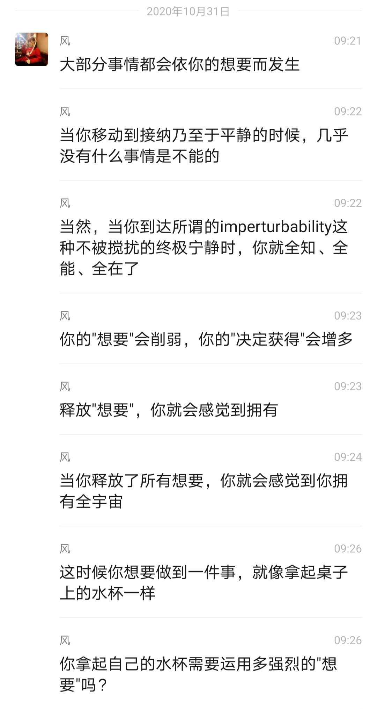

# 风谈六步骤 Step 3

第三步: 所有感受都来自想要被认同和想要控制，它们都是生存程序，释放它们。
All feelings culminate in two want：wanting of approval and wanting of control.

【2020.10.18】

风：第三步，就是所有感受都是想要控制和认同。时时刻刻你都有感受，你看到的整个世界，就是想要控制和认同。你二十四小时防卫着，不让死亡的恐惧浮现出来。防卫的机制，就是想要控制和认同。

【2020.10.23】

风：第三步是 " 所有感受都是想要控制和认同，释放它们"，所有感受的意思就是所有感受，你现在一定有感受， 它一定是想要控制和认同，你可以释放它们。
 

## 【在释放成为惯性之前，按照流程走，不要仅是觉察】

【2020.10.24】风：只要你认出想要被认同和想要控制，你会马上有一个自然放它离开的倾向，它就会在你甚至来不及问之前就消散。

问：一觉察，它就走，有的时候是，有的时候还有。

风：所以，使用流程。不要用自己发明的“只是觉察”， 它不会走的。流程已经很简单了：允许自己觉察到感受， 觉察到它是想要控制还是认同，然后让它离开。

如果你试图跳过流程，它不会奏效的，可能奏效一两次，但它不会总是奏效，因为头脑的惯性非常强大，如果不用这个技巧，你的压抑的习惯会拉着你走。

释放流程是不符合人的习惯的，所以一开始要有意识用流程，直到到达一个点，流程会带着你走。

【2020.10.22】问： 风， 请问释放到一定程度， 像你这样也是用流程一步一步释放，还是一觉察到任何想要它就离开了，就不需要再问问句了？

风：floats up and out，像波浪一样浮现然后离开。释放到后面，动力会很强大，只要你做一个释放的决定， 它就会带着你走，你不需要像之前那样努力操作了。

【2020.12.30】风：当你持续释放之后，问句都是多余的。不过刚开始，还是需要问句引导。
 

 
 

## 【2020.10.23 释放的要点在于流程，在于持续释放。不要与其他方法中的觉察与观照混淆】
清溪： 风，只是觉察到想要这个倾向直接释放。不觉察来自想要认同还是来自想要控制，这样操作可行吗？不行的话，为什么？

风： 你觉察得清晰，才能释放。当它浮现到表面来， 你就会直接觉察到，然后就会有自然的倾向放它离开。

倚天：释放的关键还是觉察的能力，对吧。

风：不是 , 是流程。不管你觉察能力多好，只要你在流程中该让你释放想要控制的时候去觉察别的，你就会卡住。

明空：平时是感受和情绪来了再释放，还是时刻觉察时刻主动去问当下的感受主动走流程呢？

风：主动用流程。
朝颜：要一件一件的去释放，一个一个人的去释放，是吗？ 风：不是一件一件事释放，是一个个感受释放。要有意
识觉察到你的感受，以及它激起的想要控制和认同。
倚天：那就是说，释放的要点就是要能够觉察到那个“想要”？风：释放的要点是流程，我无法说是觉察，因为觉察是
一个很容易被混淆的东西。
 

大道至简：释放和旁观有何不同？

风：当你旁观的时候，你想要控制还是想要认同？ 大道至简：就是不参与，只是旁观。
风： 很多人说 : 我只是观照。它的意思是把自己放在一个观照者的角度，但这是一种佯装，因为你还压抑着感受。那些驱动力还在深处运作着你，想要控制和认同还在驱动你。

大道至简：请教二者本质区别是啥？ 风：一个是压抑，一个是释放。
大道至简：旁观我理解是自然无为，有压抑还是有为。

风： 你这样做不到无为。莱斯特说，无为有两种：一种是最低的状态，万念俱灰；另一种是最高的状态，平静， 即万事万物都很完美，都是无限，没有什么需要改变的。你觉得如果你现在想要刻意去做到无为或者顺其自然，你会是哪种？

莱斯特有一句更好的概论：“方法很简单，方法也很容易。让感受浮现出来，觉察出它们是想要认可或控制，然后让他们出去。贯彻这个方法的六个步骤，会花几个月的时间来清空你所有的垃圾。”

释放法的重点当然还是持续释放，而不是持续观照。察
 

觉到你现在的感受，然后觉察出它是想要控制或者认同， 然后释放。

我修过很多种类型的禅修，修过不同的重视觉察的方法，它们真的和释放法不一样。如果用那些经验来操作释放流程，只会造成阻碍。

清溪：觉察到想要控制或者认同，只是觉察想要的倾向， 无需觉察到想要认同什么内容，想要控制什么内容，不管认同或控制的内容是任何？对吗？

风：是的。你们是不是认为一定有内容？不是的，这个世界不是这样创造出来的。你是先创造了一个心智，是先有对死亡的恐惧的倾向，然后才有想要控制和认同。然后再有 agflap 的情绪，然后才有思想，然后思想投射出物质世界，物质世界再联系成事件内容。

所以，事件内容是结果，并不是事件导致想要的倾向， 而是想要导致事件。想要驱动每一个念头创造世界。因此如果你察觉到想要，这是起因，你并不需要对应事件。

清溪：原来如此，以前完全搞错方向了，释放想要，其实是从因上放手，对吗？

风：想要是最根本的原因。
 

## 【2020.10.18  觉察感受时不需要努力】

风：当流程说“允许自己觉察到”时，它指的不是你用力去挖掘，而是你此刻什么也不做的情况下觉察到什么， 不需要呼唤努力、不需要使用控制。

课程为什么不教你“如何觉察”？ 因为“如何”含有一种头脑的努力。
比如，你问自己现在想要控制还是想要认同，你马上就能觉察到。如果不能，那你就是想让自己能，想要事情按照自己的来，那就是想要控制。这非常简单。

所以，再说一次，你们要牢记六步骤，把它放在身边， 随时拿起来看。释放的任何问题都能在六步骤中找到答案。
 

## 【2020.10.23 释放掉足够多的想要认同和控制，下面对死亡的恐惧会自动浮现出来给你释放】

芳菲： 风老师，六步骤里只有“想要控制和认同”， 没有提到“想要生存”的欲望这第三个 want 呀。

风： 这个会自动浮现，因此不需要放在步骤里刻意操作，莱斯特在 the way 里面有讲到这些。

【插一段风 2020.9.30 的分享】

风：我昨天刚好重听了一下莱斯特的两个音频，他说在释放掉足够多的想要控制和想要认同之前，你不会觉察到对死亡的恐惧（想要生存、想要安全）。对死亡的恐惧

（fear of dying) 是更深的，所以一开始你不用去考虑。我知道后面的释放法会让你同时去注意三种欲望，但最初的只要你去注意想要控制还是想要被认同。你释放掉这些覆盖住想要生存（对死亡的恐惧） 的欲望， 它自然会浮现出来被你看见，然后你就可以释放它了。

所以，莱斯特说的会简洁一些：一开始你不会允许对死亡的恐惧浮现，因为你是那样地程序化，你的所有感受都是生存程序（survival programs）， 它们的作用就是防卫你不去接触到对死亡的恐惧，所以当你释放掉这些防卫程序，底下的对死亡的恐惧就会自动浮现，That's the way it is。（笑）
 

## 【2021.1.17 cap 状态不是顶端， 停留在 cap 会发展出agflap, 彻底释放三大欲望，才会自由】

风： 莱斯特经常说释放 agflap，但是没有说释放cap。

天成：为什么会这样说？

风：因为 cap 是所谓的正面情绪：无畏，接纳，平静。cap 会吃掉 agflap。在无畏下，你会自然倾向于做出好的行动，在接纳中，你会接受原本的和谐和完美。

但是到达 cap 时，你不会去除所有的 agflap。你必须释放掉想要控制和认同才能去除所有的 agflap。

这就像有很多人问，为什么 cap 要释放？因为它不是顶端，cap 是相对性的。

你即便到达了 cap，在你释放掉三大欲望之前，你不会彻底清除 agflap。

因为 cap 是所谓的好的感受，而好的感受对应着不好的感受。

对于好的感受，如果你想要控制它，就会发展恐惧—— 害怕失去它。你想要更多，就会发展贪求——想要获取更多的好感受。
 

如果不到顶端，agflap 会被持续发展出来。除非你到达涅比卡帕三摩地，让无限存在成为你永恒的认同，这个时候，你就不会再发展 agflap。

天成：释放掉足够多的想要控制和认同，就可以到达涅比卡帕三摩地吗？

风：还要释放死亡的恐惧。

天成：要释放到接触到更底层的分离感才能到达涅比卡帕三摩地？

风：释放掉你是这具身体的分离感，在你释放掉的那一刹那，你会达到三摩地，因为你认同了无限存在。

处于 cap 时，只能说你目前的情绪状态达到了 cap，可以说你的垃圾清空到一定程度。

释放掉三大欲望，清楚所有的 agflap。

那样你就自由了，自由了就可以主宰心智。

清除所有的 agflap 要达到波澜不惊，只是 cap 是不够的。当你处在 cap 时，说明你还有与之对应的负面情绪在极深处，但是在 cap 的状态下，你更有能力向下挖掘（dig down），去释放掉那些极深的感受。
 

### 情绪能量表

| 情绪	| 压抑情绪所消耗的能量	| 余下可用能量 |
| ---------- | ---------- | ---------- |
| 万念俱灰（ **A**pathy） | 100% － 95% | 0% － 5% | 
| 悲痛 ( **G**rief) | 94% － 90% | 5% － 10% |
| 恐惧 ( **F**ear) | 89% － 85% | 11% － 15% |
| 贪求 ( **L**ust) | 84% － 80% | 16% － 20% |
| 愤怒 ( **A**nger)| 79% － 70% | 21% － 30% |
| 自尊自傲 ( **P**ride) | 69% － 60% | 31% － 40% |
| | | |
| 无畏 ( **C**ourageousness) | 59% － 35% | 41% － 65% |
| 接纳 ( **A**cceptance) | 34% － 15% | 66% － 85% |
| 平静 ( **P**eace) | 14% － 0% | 86% － 100% |

一曼注：agflap 是情绪表中前六种情绪的英文首字母缩写。当在释放法中提到“agflap”时，通常指消极情绪， cap 代表情绪表中的后三种积极情绪。

从这个表格中我们也可以看到，为什么我们处于消极情绪时感觉没有精力去行动，因为大部分能量都用来压抑情绪了。
 

## 【2020.1.11 感觉没有感受 / 感受模糊不清怎么办】

风：所以我是不建议人们去把自己的经验总结成方法的 , 永远要回到原始流程，完整的流程。

首先你要放松身体，一旦你发现自己在用力做释放， 需要停下来放松身体。因为很多人因为过去的错误习惯， 习惯了去用力。

释放时如果你试图找一种感受，那就是在逃避当下的感受，你全天候二十四小时逃避着当下的感受。

释放不是一种需要你付出极大精力的活动，有人可能因为以前错误的练习方式对释放有错误的概念。

接受不清晰的感受，不清晰的感受是一种感受，需要认识到这一点。你不存在没有感受的时候，你只有不把感受当感受的时候。

莱斯特专门提到这个 vague feeling（模糊不清的感受），模糊不清的感受是因为你在逃避感受，去感受你的模糊不清吧。

没有感觉，是一个模糊不清的感觉，或者不明显的感觉。去有意识注意你的模糊不清，先注意到它，不要那么急。如果你去感受时，你的感受是 " 没有感受 "，这时候不要去找别的感受， 只是允许这个 " 没有感受 " 在这里。先去
 

注意这个" 没有感受"，或者说空白的感受，有意识注意它， 直到你认出它是一种感受。

没有感受，模糊不清的感受，只是你在逃避感受而已， 它并不是真的没有感受。

你第一个被压抑的感受是死亡的恐惧（想要生存）， 然后发展了想要认同和控制，它们发展了九种情绪分类， 还有许许多多的个体感受。

释放法里面我们说情绪，指的是agflapcap 那九种情绪。

我们说感受时，个体感受、情绪、欲望，所有的都是感受。
 

## 【2021.2.3 以轻松的心态释放】风：试着放轻松看看。
伯利恒之星：好的。

风： 不需要让它变得很明显再释放。如果你把释放这件事变得非常痛苦，那你当然就不想释放

伯利恒之星：也是。

风： 带点探索的心态，轻松的心态。看看问句之后它会发生什么。不要那么苦哈哈的（笑）。释放不是做作业。

伯利恒之星：你真了解我，好，我试着轻松一些。

风： 比如一桌人坐着打麻将。有个人说“好像有一辆凯迪拉克不错”。你一只手摸一张牌，一边随口说道 " 这样啊，那来一辆凯迪拉克 "。

嗯，好像有点感觉不可能？想要控制还是想要认同？ 貌似是想要认同。能够放它离开吗？好像能。

再 check 一下，好像轻松点了。我的凯迪拉克到了吗？ 我靠，还没到。这是想要控制和想要认同呢？就这样释放啊（笑）。一边摸麻将一边就可以让凯迪拉克到手了。等你打完麻将，释放得差不多了。出去一看，门口一辆凯迪拉克。
 

## 【2020.10.22 当下更能觉察到哪个感受，就释放哪一个】

冰紫：三种欲望打包一起问可以吗？

风：不可以。不是你打包就会更快一点。感受的原因， 当然是三种都有，因为认同是控制的原因，生存是认同的原因，但是你释放的只是此刻你更能觉察到的那一个。

## 【2020.9.30 从入门到最后释放什么】

风：释放情绪是学习释放法的入门，就是说，它让你学会如何释放，熟悉释放的过程。熟悉之后，你就释放两个想要（想要控制和认同）。等死亡的恐惧浮现，你就释放死亡的恐惧。就这么简单。
 

## 【2020.10.24 清楚释放是什么感觉，就可以开始释放“想要”】

风：如果你一开始就能释放想要控制和认同，那当然可以，但没有体验过释放的人很可能不知道什么是释放， 会把压抑当作释放，这时候需要从释放情绪开始体验。

等你掌握了这个方法，这个流程，六步骤就是你唯一需要的指导了。
 

 
 

 
 

## 【2020.11.27  释放感受不是允许接纳感受】

风： 允许感受浮现和离开的确是释放流程的一个简单描述，因此在方法上，很多释放法练习者很容易会转变为允许接纳。

不进入六步骤，就到达不了自由。

有一个东西，我们叫 " 纯粹觉知 "，或者叫 flow of awareness，莱斯特在早期所说的觉知之流，他描述的是最终的存在的状态，很多种描述，但是抵达它的过程是严密的。

当人试图内省时，或者只是安静的坐着，等同于试图强行分开感官和生命力。人在达到 pranayama 这一阶段之前，生命力是向外流的，向感官流动。

因此，当你在身体和心理层面的生命力（prana) 没有被你完全掌控之前，试图用头脑控制自己纯粹觉知，这是无法奏效的。生命力向内流，感官自然关闭，这时候觉知才有可能纯粹，以至于达到三摩地，两个阶段的三摩地。

六步骤是一个完整地图，其中任何一步没有做到都会使你停滞。当人们在心智中认为自己保持在 " 觉知 " 中接纳一切时，实际上已经停止了释放。丢掉了第四步的持续释放。
 

在焉：生命力向内流，在释放法中是怎么达成的呢？

风： 不断在起因层面释放想要控制和认同。因为你流向感官 = 流向世界，世界 = 想要控制和想要认同。

如果你不断释放，生命力就会被完全控制，它不再向外。

在焉： 感觉把注意力放在腹部，好像脊柱挺直，释放更加顺利。

风： 释放实际上不需要固定姿势，把注意力放在感受中心是对的。

在焉：胸腹是指胸部和腹部的大片区域吧。风：就是瑜伽里的心轮。
在焉： 你进入三摩地，应该是非常深的入静状态。仅仅是日常生活随时随地释放就可以达到吗？还是必须有一定时间长度的安静集中释放才有可能进入？

风： 三摩地有两种，一种是有种子的三摩地，一种是无种子的三摩地。当你到达无种子的三摩地，就可以随时进入，因为作为先决条件，身心的生命力已经被完全掌控了

在焉：可以详细说说吗？
 

风： 只需要一个决定就可以进入。有种子的三摩地我很早就达到过，在我中学修习帕奥禅法时，它把烦恼镇压了下去。

瑜伽科学中说的涅比卡帕三摩地，是一个已经转向的阶段，类似于佛陀说的预流，生命流向的转变，在莱斯特那里，就是彻底达成第一步。

接下来你的每一个抉择都会自然是趋向自由的，只有在这时，你才会从凡夫之流转到圣者之流，并且再也不会退转，只有自由一个方向可以前行。

在焉： 怎么可以达成第一步，是一个意愿，还是释放的结果？

风： 是不断贯彻六步骤的结果，这可以通过 the way 里面的一个指引，比如通过释放获得想要的一切。当你这样做时，你会慢慢发现你在一切中想要寻找的都是快乐。而快乐的唯一来源就是心智安静下来，让无限存在展现了更多，因此你就会越来越趋向自由。

这时候你就会自然放弃其他方向的尝试，全部的生命力都集中到一个方向，只留存一个目标，那就是自由，这就完全达成了第一步，就会自然掉入后五步。
 

## 【2020.10.23  释放与体感无关，释放是释放心理感受】
美丽人生：释放掉饥饿的感觉，就不用去吃饭了吗？ 风：释放的不是饥饿的感觉，饥饿的感觉是身体感觉，
已经是结果了。

你要释放它的起因：心理感受，以及驱动它们的想要控制和认同，以及驱动想要控制和认同的“对死亡的恐惧”。

想要生存的欲望就是对死亡的恐惧，对死亡的恐惧是莱斯特经常用的词。

饿是一种身体感受，这其实已经是表达了，是一个结果。当你释放了想要控制，可以随时关掉饥饿感。

again，身体感受，是一个结果，已经是表达了。

所以，我发现很多人对身体感受做释放，这不是释放法。释放法释放的是 feeling， 是情绪， 是驱动情绪的原因——想要。

当你释放掉这些原因层面的东西之后，身体感受这种结果层面的东西就会变化。

如果你对着结果——对着身体感受释放，你就会困难重重，因为你无法通过砸镜子里面的人来改变姿势。

如果你想要改变身体的痛苦 , 释放想要改变（控制）。
 

不用释放身体的痛苦， 它是一个结果 , 如果你释放掉对它的控制，它马上就会被纠正。

当你释放对死亡的恐惧时，会带出来痛苦的身体感受， 但是重心不是在释放身体感受上，而是放在你对它的情绪和基本欲望上。

（风引用了一段 the way part1 里的对话）

学生：有一次我去操作释放这个对死亡的恐惧，我带出了一些很沉重的身体疼痛，所以我一定是有什么做错了， 但是这花费了很长时间去搞定它。

莱斯特：你没有释放它，反而是把它在身体中表达了出来，你在让你的身体走向死亡。痛苦是指向死亡的。所以， 你并没有释放它，而是让它表达在身体上。

美丽人生：释放了控制，病痛自动会消失了吗？

风：释放了对它的所有心理感受，就不会表达在身体上了。

痛苦实际上是对死亡的恐惧在身体中表达出来的结果， 也说是说，如果你压抑对死亡的恐惧，它就会在身体中表达出来，形成痛苦的身体感受。但如果你释放了对死亡的恐惧，它就会随之消散。所以，不要做六步骤以外的事。

除了想要控制和想要认同，以及之后浮现的对死亡的
 

恐惧之外，你不需要释放任何其他东西，因为一切都是它们三个的结果。

在释放完认同和控制之前，对死亡的恐惧会偶尔出来， 但不经常。

【注：莱斯特说，只要你持续释放想要认同和控制， 对死亡的恐惧（想要安全 / 生存）会自动浮现出来给你释放。所以六步骤当中没有提到释放想要安全。】
 

## 【2020.10.22 要释放的是“原因”，不是释放“结果”】

风：身体感受已经是 " 表达 "（expression）了。

第一个被压抑的是对死亡的恐惧，然后它发展了想要认同。想要认同发展了想要控制，想要认同和想要控制发展了九种情绪状态。

九种情绪状态发展了许多细微的感受，感受发展了所有思想。思想投射出去就是你的物质世界，物质世界包括你的身体，因此身体和整个物质世界，是你的 " 造物 "， 是一个投射的结果了。

释放的时候，你释放的是作为原因的情绪、欲望，而想要生存（对死亡的恐惧）是想要认同和控制的原因。

所有感受都是生存程序（all feelings are survival programs）。你释放的是情绪（feeling），而不是已经作为结果而表达在身体上的身体感受。

当你释放掉情绪，你的那些疾病的身体感受也会随之消散，因为你的身体仅仅是星光体的精确拷贝。

课程仅仅用两天时间让新人来熟悉释放情绪，情绪表格是辅助你去辨认你的情绪。因为很多人除了身体感受， 无法辨认出自己目前的情绪是什么，因此他们需要表格的辅助，很快你就可以过渡到释放欲望（想要）的阶段。
 

直接释放想要认同、控制，以至于想要生存（对死亡的恐惧)，清理底层驱动，这个才是释放法这个工具的用法。

> 想要控制和认同是一种限制你的感受，但有时候我们就会这么愚蠢，我们宁愿要限制不要自由。有时候你会卡住真的就是因为你不愿意释放它们，just want it。 
当你认识到想要控制和认同限制你时，你就更想要自由。
> 
——风 2020.10.18

 

2020.12.12

 

 
 

## 【2020.10.23 想要安全→想要被认同→想要控制】

风：想要改变是想要控制的一种。

如果一个东西你感觉很不喜欢，你就想要改变； 如果你感觉很喜欢的，你就想要维持、想要占有。那都是想要控制。
想要控制的具体解释，就是 " 你想要世界按照你想要的那样来 "。

想要控制是最表面的想要。

你为什么想要占有这个、想要改变那个呢？ 因为想要得到认同。
为什么想要得到认同呢？ 因为想要安全。
你觉得别人认同你，你就能活下去了。想要安全、生存是最深的那个想要。 想要生存发展了想要认同和想要控制。想要认同和想要控制发展了 agflap。
 

## 【2020.10.18】

风：控制是好事情，想要控制不是。想要 = 匮乏，想要控制，是对控制的一种匮乏感。

## 【2020.10.18】

风：持续释放那些你想做到的事情上的想要控制和认同，然后你就达成了你想做的事。
 

## 【2020.12.16 释放了一切感受后，是超越一切的平静】

快乐时光 : 释放掉了对身体的掌控是一种什么样的状态？在此之前可有什么征兆？

风: 
释放对身体的掌控？

快乐时光 : 释放掉了一切感受的掌控。

风: 
释放了一切感受吗？ 快乐时光 : 嗯。
风 : 超 越 一 切 的 平 静， 那 是 不 可 描 述 的，
imperturbability，没有任何人事物可以打扰到的绝对宁静。

莱斯特说，在梵文里面它叫 Nirvana， 涅槃。在你通过任何方法让心智暂时全部安静下来，能够短暂地接触到它。这即是瑜伽科学里面所说的萨比卡帕三摩地。

但是在萨比卡帕三摩地中，种子的力量还存在，因此还会退失。而当你达到涅比卡帕三摩地时，一切种子都失去作用了，这时候你还有残存的业力，但是你消除它只是个时间问题。

有的大师会选择把那些残存的业力保留更长时间，以不断地回到世界上来帮助更多人，有的大师则会达成帕拉穆克塔，成为一名悉达（完美的存在），直接融入无限。
 

许韬：这些是知识还是知道？ 风: 
对你们而言是知识。
快乐时光 : 其他的我就不懂了，傻傻的往前，持续释放就可以对吧？

风: 
嗯，贯彻六步骤。

涅比卡帕三摩地在六步骤中，仅仅是第一步的完全达成。随后工作才刚刚开始，你会掉入到后五步中去。

你的每一个选择、决定，都自然地趋向自由，因为种子不起作用了，即意味着朝向世界的方向已经不起作用， 完全地朝向自由这一个方向。

宏: 辞职算这样的事吧？

风: 
不是，这和任何行动都不相关，这仅仅是你发现了莱斯特所说的“快乐的唯一来源”，当你发现时，你就可以调转方向。在方向的彻底调转时，你会进入所谓的涅比卡帕三摩地。种子失去作用，意味着世界的方向完全失去作用。

清溪 : 是不是需要放下工作，还有离开人群？觉得在人群中，人际关系交往中，心智就是活跃的。

风: 
你想要压抑那些活跃的心智吗？
 

宏: 我讨厌人际关系，我非常希望能过隐居的生活。风: 
那是“对世界的厌恶”。
清溪 : 目前需要释放这些活跃的心智，但释放干净彻底了，最终的走向会不会是上面提到的那样？离开人群？

风: 
这取决于你的选择，对世界的厌恶并不是想要自由，要了解这一点。厌恶和贪恋是成对出现的，你对世界有一个想要的贪恋，同时就会有厌恶。我发现有许许多多的人，将“对世界的厌恶”当成是想要自由。

清溪 : 哦，那就是当真正释放自由了，融入人群与离开人群是没有区别的 ? 无二无别，是这样吗？

风: 
无限存在的永恒宁静不会被打扰到。
 

>压抑的感受在潜意识中持续驱动着我们的潜意识念头，mind is only creative，每一个念头都会显化，不管你去不去看它。 
潜意识念头仅仅是那些我们现在不去看的念头，我们把它程式化，让它在后台自动运作。 
所以，被压抑的感受也是你的感受，它依然会驱动那些你不想看到的念头自动地在潜意识中运作，因此，不要压抑感受，释放它们。
> 
——风 2020.10.22

 

## 【2020.10.15 在日常生活中，每当我们使用身体 / 使用感官时，就可以觉察背后的想要，释放它】
注：第三步对我们日常的释放是一个极大的提醒，在移动身体、用身体操作某些事情、面对某些突发事件、产生某些念头情绪等等背后，都必定有“想要控制 / 想要被认同”这两个程序在运作。

看到所有感受都源自两个想要，随时发现，随时释放。关于这一点，在日常生活中如何更好地实践呢？下面这段分享也许能给你带来启发。

风： 我昨天还有个更深的体验，稍稍考虑了下，还是分享出来。

那是在我去买水和食物过马路的时候，我发现自己下意识地防卫，在更细微的层面上看到了自己的想要控制， 于是我释放了它。

持续释放了十几分钟，我自然地闭上了眼睛，一路被一种内在的“知道”一步步指引，走回了家。

这种知道不是视觉，不是听觉，不是感官中的任何东西，但是它比视觉、听觉更加周遍，只是一步步很笃定地觉知，其中没有犹豫踌躇。

余生可贵：是一种信任？
 

风 ：如果你说信任，这里面还有二元性，但那个感觉并不是分离的。它是一个“知道”接着一个“知道”发生。我知道我要往这儿走，我知道下一步要往那儿走。

今天我还在释放，因为早上我又用我的眼睛来工作， 但我发现我可以用觉知来工作。

现在大概是一半一半，有时候习惯性地用眼睛工作， 但是觉察到之后，释放掉我努力去看地想要控制，就能够回到觉知工作。

我是无限：你还在工作没闭关啊。

风：我说的“工作”指的是看路，看东西，比如刷牙洗脸。这里面的问题在于，这些真的是想要控制。当深入时，你会接触到，甚至我看到我有意识运作了五脏。但这些东西一开始不用被考虑，当释放了一些对死亡的恐惧时，我发现对身体本身的控制就变得明显起来。

比如我一个简单的坐姿，坐起来，需要运用能量，需要唤起控制。把身体维持，也需要唤起想要控制。

紫： 是不是头脑认为不控制就会死，因为怕死，所以想控制？

风： 嗯，最底层的，是想要生存。随着释放会越来越清晰 我现在最大的问题是，很容易停止释放，要不断用
 

六步骤提醒自己，否则就会进入一种觉知的状态，感觉周围的事情都非常完美和谐。

每当这时候，就要提醒自己第一步，因为这个停止也是因为想要控制。

繁星：风，通过释放，你变得平静，安宁，舒适了吗？ 我们释放的目的是为了找回平安的自性对吧，而不是为了释放而释放，保持不断释放的姿势。如果已经安宁了，又为何非要强迫自己释放呢？不安宁才需要释放啊。

风： 每一次释放，你都会感觉更高，原来的平安只是相对的。只不过到了一个舒适的阶段，你就会缺乏动力。先前因为活在痛苦中，所以有强烈的动力释放。

在后来，就必须要加强第一步，为了自由而释放。莱斯特有一篇音频《get high to release》，专门批评过这种做法， 这样是永远达不到终点的，因为这样是为了feel good 而释放。

当你感觉好的时候，你就停下来。停下来的时候，你就在压抑，生存程序就会发展。如果你不是往自由的方向走，就是往限制的方向走。

因此，莱斯特强调，要在你感觉很好的时候继续释放。在很高的时候走得更高，higher and higher，而不能停在当下这个很完美和谐的感觉里。
 

去听听那篇《get high to release》，就明白了。you don't have to wait you down then release，get high to release。

如果你感觉到平安，释放了那个 " 平安 "，你会感觉更好，试试看吧。

想要维持这个舒适，也是想要控制。

如果你不释放，你就在压抑，没有所谓的静止不动。不在前进，你就在后退。
如果你不在 undo 你的心智，使它更安静，那么你的心智就在变得更嘈杂。因此在到达终点之前，要一直持续释放，make it constant，这正是第四步。

生存程序，就是你的感受，感受会驱动感受。如果你压抑它、隐藏它；如果你不压抑它，就释放了。

如果你释放完了所有的感受，也就是生存程序，一切就结束了，你就自由了。

这里面并没有一个需要停下来的中间点，所以有一个学生问他应该如何如何的时候，莱斯特在音频里面说“you stopped. There is no stop in the six steps.”
（风下面现场翻译了一段《get high to release》的话分享给大家）
 

有多少人是为了感觉好才去释放？你究竟要等多久？ 这就是你的问题所在，你没有去做它。

你们做的是什么？你只想停留在好感觉上，因此你只会感觉不好之后再去释放，这样才能继续得到好感觉，因为只有一种好的感觉，就是释放后的感觉。

过了一段时间，你再次感到不好，于是你释放以得到好的感觉，反复如此拖延了整个过程。

如果释放的目的是自由，几个月的时间就足以清理所有的垃圾。如果释放是为了摆脱困境，这样一来，就是一个极其漫长的过程。

（ 注：《get high to release》这篇文章有非常好的提醒作用，下面摘选一些文中的其他段落，感谢翻译者Roller）

一开始你没有选择，你深陷在沉重和痛苦的状态中， 你需要有从地狱中走出来的动机让你去释放。但是现在你已经进步上升了，那应该成为过去。

释放的理由应该是去向自由。你所能得到的最高最好最美妙的感觉与状态就是完全的自由。你相信吗？

好吧，那你为什么不全力以赴到达最高的状态，去往自由呢？那是因为你一直坚持着这个沉重的状态——“自我”。
 

你无法快速摆脱困境的原因是，你释放后自己会感觉良好，这会导致你在目标达成后停止释放。如果你为了自由而释放，就不会停下来。你会珍惜你获得自由的一切机会。每一次下跌对你来说都是一个绝佳的机会，每次跌落
（down）都是释放和上升的绝佳机会。

你没有落入到这六步骤的后续步骤，因为你遗漏了第一件事——想要自由，相反的而是想去满足自我，满足“我” 这自我感。

你并不想自由，这就是为什么现在你们都还没走完全程的原因。

追逐外在世界的美妙状态，每当获得一分的快乐，你就会得到一分接着又一分的痛苦。如果你看一下，这是如此明显。

每天都在向你证明，你的幸福并不是去满足心智，你不会赢！通过满足心智（body-mind）的每一分幸福，你都会遭受极大的痛苦！每一个想法都有附着一定的痛苦。为什么？它把你的注意力从你的存在中移开。当你心智安静时，你将身处最美好的地方。

因此，我建议你从现实中醒来。Release when you’re high。 应该用大写的字母写在你的笔记上：RELEASE WHEN HIGH. GO HIGH TO RELEASE.（在高处释放，到
达高处继续释放）
 

所有被抑制的能量现在都在试图冲出来（push up）， 而你试图将其抑制下来。停止按住它，它每一点都会释放出去，它会马上排出去。压制它是坚持自我程序。

自我感包含所有喜恶，所有思想。你必须将注意力从它上移开，并将其放在存在上。

Release when you’re high。我们状态越高，我们就越接近我们的存在。

高峰状态与宁静是同一件事。

当你 go high 时，你就充满了能量。在万念俱灰、悲观的状态时，你只有很低的动力。

往上（Up here），你的动力、能量可以达到高峰。因此， 进入该区域，然后挖掘出对死亡的恐惧。

往下（Down here），你会继续深陷其中，无法放手。往上走，你可以面对死亡的恐惧。而且，当你释放了大部分的恐惧时，就可以相对轻松地释放剩余部分。去释放吧。

如果我前一段时间对你说过这些话，那将毫无意义， 因为你陷于 AGFLAP 中，以至于看不清东西。你唯一看到的是 AGFLAP。
 

但是我们每个人都已经进入这个领域，知道自己的感觉，可以置身其中，然后深入挖掘并面对对死亡的恐惧， 不安全感和对生活的恐惧。

这样一来，你将摆脱所有恐惧。

恐惧是不自然的。永恒的生命有什么要担心的，尤其是关于死亡的恐惧。因此，从这里开始，重点放在这里。Feel high，然后挖掘对死亡的恐惧并释放它。

心智（头脑）必须安静下来，然后你才能认同自己的存在，这就是终极状态。

这就是我今天想对你说的。滚出坑，上升，完成过程！ 只需要几个月或更短的时间。如果第一步达到——想要自由多于你想要满足自我，那么其他步骤就可以实现，然后你会一直贯彻六步骤。

这令人相当振奋，因为你会越来越高，直到无法再高为止，无处可去——你遍及整个宇宙，你是无限的。简单来说，就是会认同自己的存在，“我是我”（I-am-ness）。然后，你将看到整个的全部真相。只有我的存在。其他一切都是想象力，是一种幻想。

所 以，我 说，释放 吧。记在心 上：Go high and release。（去到高处并持续释放）
 

当然，如果你正处于低谷，请释放以升高，以便更深入地释放。不要停留在那里，从那里继续前进到达更高处。
（move on from here to higher.）

不要停下来，往高处走，利用高峰（highness）释放， 直到无处可去；你遍布整个宇宙。

 
 

 
 

（注：关于“不要释放到好状态时就停下来”，在此插一段风在 2020.9.20 的分享，以提醒我们。此时风还未进入极佳的持续释放阶段，很快他在一周后就有了突破。）

风：我记得两年前吧，那是我的高峰期，我觉得大概大部分时间都处于 cap 里面，但是我知道下面还有很多垃圾没释放，不想去看那些。

后来停止了很久很久，就是不想释放。还是没有下决定，一次性走到终点，想待在那种美好的状态里，然后很快那些负面情绪就回来了。

停止释放后，这个比较好的状态只持续了几个月就回到了原状，头脑又变得很嘈杂。

但我现在的感受很不好，因为以前经历过一个相对高的状态，所以掉下来之后，每天都在煎熬，难受得很。

说个粗俗的比喻，就像猪圈里的猪，吃过新鲜饭菜之后就不觉得泔水好吃了，再回来吃泔水就比先前不知道有新鲜饭菜时难受很多。

我总是会停下来，但是我确实意识到了头脑是个垃圾堆。如果一辈子活在头脑里，简直太悲惨了，来来去去都是相同的欲望和反应啊，非常程式化。
 

## 【2020.10.18  通过释放想要，获得想要的一切】

注：一般我们提到“仅仅通过释放获得一切”，对于“一切” 的理解，我们可能往往想的是这些诸如此类的事情，比如获得金钱，得到某个物品，身体恢复健康，学会一门外语，获得某项才艺技能，获得某种超能力等等……

其实“一切”并不只是指一个阶段性的目标，你可以在任何大大小小的事情上放大对“一切” 的觉察力，因为我们每一刻其实都有想要做到的事情，就像仅仅只是抬一下胳膊，关一下灯。

我们可以通过释放毫不费力让胳膊自动抬起来吗？下面风引导群友释放的对话，也许能给你带来“通过释放获得想要的一切”启发。

JianWang：风，莱斯特用举手来说明 “get everything by releasing only”，这个你做个示范说明吧。

风：你想试试吗？你现在就可以试试。你想做到什么？ 下一件你想做的事是什么？

JianWang：就比如“举起手”。

风：嗯，你能看到这是想要控制还是想要认同吗？

JianWang： 控制。
 

风：放它离开了吗？

JianWang：能。

风：还有吗？

JianWang：还有。

风：觉察到更多。它离开了吗？

JianWang：更多精细的出来了。

风： 嗯，持续释放它们你有看到随着释放，你越来越不是个“行为者”（注：doer，也译为“做者”）吗？

JianWang： 慢慢举手动力越来越强，可以了，他自然的举起来了。

风：That's it。任何事，你通过释放来做到。这就是 get everything by releasing only。字面意思。

JianWang：一举一动皆有“控制”。
 

## 【2020.9.21 如何对目标做释放】

风：关于目标，第四个视频的讲法是这样的： 写出你的目标（以现在时），
然后看着你的目标，

释放你对目标的第一感受， first feeling。
好了，完了，就这么简单。

第一感受释放掉了，再看看你的目标，再释放此刻的第一感受，直到你感觉目标已经实现，注意是“已经实现”。

其实上面我已经复述出几乎全部内容了，剩下的就是重复引导，原始的释放法真的很简单。

我以前设定过目标释放很多次，现在我很少设定目标了，因为我发现没有什么真正想要的。

我说一下自己关于目标的经验，“目标是可以让你持续释放的一种方法。你看着目标，只要不欺骗自己，就会有大量“不可能”之类的感受涌现。当然也有一些愤怒、悲苦之类的。五花八门的情绪。 按照流程一个个释放。释放之后，有一种清晰笃定的感觉，“知道”它就是我的。
 

就是看着目标，冒出一个情绪释放一个，再看看目标， 它有没有到“已经实现”的状态。如果没有，那一定是想要控制和想要被认同（情绪上是无能为力、贪求、愤怒、恐惧等等），再释放最上面的感受，一个一个来，直到全部清空。

我个人的经验是，这样持续下去，你会到达一个“我很自信目标能成功”的状态，但是这个状态不行，这应该处于自尊自傲和无畏上下，这个状态还是要释放。

目标流程我检验过很多回，一般来说，这个“我相信肯定会实现”的情绪下面还有很多潜意识情绪， 释放之后又会有不少涌现出来。

真正的目标完全释放是什么感受呢？是那一刻“知道”
（不用思考、不用相信）目标已经是我的了，非常清晰笃定， 仿佛它就在我面前了。你这时候不会想做任何事去得到它， 因为完全确认它已经是我的了。这时候我一般不会再想它了，会做其他事情去，接着它自然就来了。

这个目标流程几乎百试百灵，可以从小事上开始。莱斯特说，如果你不能成为赢家，那个挫败感就会一直伴随你。

所以一旦设定目标，你就必须达成它。因此一开始不要设定得太大，让你望而却步，通过实现小目标积累释放的动能。每一次成功，把收获写下来，这样你就会越来越会运用目标流程。
 

我是无限：我真正通过释放没有实现任何事情。

风： 我之前也是。后来听了莱斯特的音频，发现我有一个限制性观念，“我不可能对一个目标释放到它实现”。

这背后伴随着以前的挫败感，莱斯特在 winner 那个视频里是这样说的“你必须做赢家，哪怕只是为了勾出潜意识中的嗔恨，你也要做赢家”。不应该把那个“挫败感”， 那个“我不能”的感受保持在潜意识内。

因为我发现一开始做释放，大家都野心勃勃想要去实现目标。在此之后就发展了一个想法，“太执着目标容易让释放卡住”，是不是多数人都有过这个想法 ?

后来我才知道，这个限制性观念是错误的，你这其实是在说，“我不能实现目标”，而“我不能”是一种挫败感， apathy。个体在实践途中，会发明很多限制性的说法，而这个莱斯特都没有说过。所以在后期音频中，我看到莱斯特经常纠正学生的限制性的说法。

所谓的“目标会阻碍你释放”，其实不是这样的，是你的挫败感（无能为力感）在阻碍你的释放。

目标设定是 sedona method 流程的一部分，它的目的是为了勾出被你隐藏起来的情绪和基本欲望。

一个真正体验到完美和无欲的人当然是另一回事，但
 

是如果一开始释放时回避目标、想要这些东西，并不是在释放它，而是不想看它，把它压抑到更深处。

莱斯特的释放法已经形成一个非常实操的循序渐进的体系，在释放法中介绍了一些你可能用到的工具。目标这个工具的目的是让你压抑的感受浮现。在你慢慢改变了这个习惯之后，释放了关于目标的挫败感，你就不需要专门设定目标了，但是“改变你的不能够，使之成为能”，这件事很重要。

看看目标背后的情绪，上溯到想要控制和想要被认同， 仅仅是让它浮现，让它离开，重复这个流程。这些流程的设计是为了帮助你持续释放。

所谓目标流程，是一种对潜意识中压抑的情绪和欲望的勾起。如果你本身就处在一个非常困扰的情绪中，它非常明显，那你先不用操作目标流程，释放你能够觉察到的。

释放就好了，形而上的讨论其实帮助不太大。释放， 就能清晰地知道是怎么回事。我的意思是智性问题，那些问题只是在试图用一种知识的说法来填补你的知识。在释放法这个完整体系中，所有问题都可以通过释放解决。

对形而上的讨论，应该这样说 : 无论我们对“真理” 下多少定义，它都不是真理本身。通过释放，然后亲自体验它，这比用心智去讨论一万遍都要有用。
 

## 【2020.12 为目标定一个不超过两周的释放时间】

风：定个一两周的目标吧，历时太长的目标会让你失去动力，而且实际上处在拖延之中。

不可能的感觉，是你处在 agf 的情绪状态中，它背后有想要控制，也有想要认同和安全。

达成一个极小的目标，不超过十几分钟。 达成一个一般的目标，半天时间也就够了。
达成一个你认为的很难的大目标，需要多长时间？我认为不超过一个星期。

如果一个星期做不到，是你没有真正地运用六步骤。

所以，不要拿自己开玩笑。easy or impossible， 简单， 或者不可能。能够理解这个概念吗？

时代万物互联 : 只有这两种选择。要么简单，要么不可能没有第三种。

风: 
嗯。

Cynthia: 您说的这种释放是持续释放吧，一周达成一个很难的目标，这一周应该是持续不间断地释放吧。

风：持续不断是关键。
 

## 【2020.11.23 当目标到期失败后，释放挫败感】

风：目标设定的一个重大目的，就是为了把这些压抑的挫败感勾出来。

所以我甚至建议当你到期失败了，就写上失败，面对积压的挫败感，进行释放。

你无法把那些反对程序压抑在潜意识中的同时获得成功。无法实现一定你内在还有程序反对它，仅此而已。

先前你保持在潜意识的挫败，你是看不到的，现在就看到了。因此通过目标设定勾出这些挫败感是好事。当挫败感浮现出来，你可以决定释放或者把它们压抑回去。我决定释放它们，聪明一点。

如果你不把它勾出来释放，你就永远没有实现目标的能力。因此，即使你抵触它，也要定目标，这很简单。

你逃避看它，它就一直待在里面运作。

## 【2021.1.3】

先达到目标，要不然，你很难下决心去自由。
 

## 【2020.11.24   对于失败的目标，可以再当一个新目标释放】

风：（如果目标到期没有实现），那得写下失败，然后对挫败感做释放。

再定一个新的目标，可以是同一个目标，但是要以新目标的态度去对待它，就像你第一次面对那个目标一样，否则你就会破罐破摔，会拖延。
 

## 【2020.11.24 要对目标释放到什么程度——释放到你感觉目标已经实现，非常清晰笃定，完全确认它已经是我的了】
风：给点力，先实现个目标出来。

Go All The Way: 现在在万念俱灰，什么都不想做
（笑），就想着拖一拖，晚上释放吧，就是不是现在。

风：（笑）

Go All The Way: 我以前释放基本不困，就是闭关第一天特别困。

风：你知道为什么吗？

Go All The Way: 为什么？

风：因为你在逼迫自己释放（笑）。逼迫，头脑就会反抗， 反抗的方式就是犯困。当你试图郑重其事地做一次大的释放时，就是这样。你非要摆出一幅“准备好了啊，我要开始释放了”的姿态，头脑当然会反抗。

我是无限： 比如我一个锅的目标，我就能接受，就500 块嘛，实在不行，十块钱，再不行一块钱吧。

我是无限： 我觉得我的挫败感不是很强，去释放也挺好释放的。

风：不是习惯了吧。
 

伯利恒之星：破罐子破摔了。破罐子破摔只是逃避而已， 只要我逃避，我就不会尝到失败的痛苦。不能让失败成为习惯。

风：完全释放的感受是，你会完全知道它是你的了。然后你会自然地放下它，你的心智不会再围绕它，然后它就来了。你会在此刻看到、品尝到你想要的，因为你无比确定你已经拥有了。所以你不会再有期待，因为你已经得到了，你会很自然地享受完然后把它放下。

对一个目标完全释放的感觉并不是你相信它未来会到来，而是你此刻就看到它是你的了，你知道它是你的了， 这才是完全释放。

我估计大部分人都没有体验到这种对目标的完全释放。他会“知道”自己已经有个锅，不会有任何怀疑，因为他知道了。
 

## 【2020.11.24 目标释放要释放到清晰知道“现在”彻底实现】
风：你想到你自己拥有的车是什么感觉？尽管你现在没有去看它，但你清晰地笃定它就是你的。

倚天：心智不再围绕它，就是真正放下了？

风：这里的心智不再围绕它的意思，是没有勾子。即使你现在有意识去想它，你会马上察觉，" 哦，它已经在那儿了 "，然后就会自然放下它。

目标释放达到这个程度，你才有主动性。你不是在那儿可怜巴巴地做释放，然后张望一下“上帝有没有赐予我？ 我有没有完全交托？”，而是释放到它掉到你的膝盖上。

伯利恒之星：必须要有主动性，不是等待。

风: 
就像假设你有一个女朋友 , 你每天醒来的时候，你也没有看到她, 但是你知道她是你女朋友。所以我每次问“目标搞定了吗？”，并不只是说实物有没有到，我是在问你的目标完全释放了吗？有没有清晰地知道？

Roller：如果还有一丝怀疑不笃定，就是不完全。

风: 
嗯，首先你要有意图，然后释放关于它的所有感受， 你就得到它了。
 

我是无限：我觉得它会来，但是觉得不会现在就来，会拖几天。

风: 
那不对。
伯利恒之星：就得现在。不管你在哪里，现在就得实现。风: 
你的心智让它待在了未来。我告诉你为什么。因为
心智是不会区分时态的，心智是以图像的形式思考。

因为心智以图像的形式思考，所以当你说“会来”的时候，呈现的画面就是“没有”。

你必须释放到“已经有了”，才会在物质世界显化出来。

伯利恒之星：所以只有有或者没有。你这次解释得够清楚，我之前没有完全明白。

风: 
心智只是以图像的形式思考，创造以光束发生，以一帧帧图像的形式发生，所以我们的世界荧幕看上去是连续不断的。
 

## 【2020.11.24 目标是为了勾出你对世界的厌恶】

伯利恒之星：刚才释放了很多东西，控制和认同，我觉得一定要为了自由去释放，而不是让生活好一点。

Roller: 对，让生活好一点很容易停下来。

伯利恒之星：我们释放去实现目标，不管是女朋友，钱还是锅，目的不是生活好一点，因为那是不够的，真的是要为了自由。把生活变好一点反而复杂化了，而且肯定得花多得多的时间。

风: 
目标是为了勾出你对世界的厌恶。物质世界有什么好的，这个车架子有什么好的，（笑）物质世界没有什么是特别好的。

伯利恒之星：就是，没什么好的。莱斯特留下来不是这里很好，而是让大家提升到他的层次。

Roller: 先超越物质世界吧。

伯利恒之星：这是一定要的（笑），不然只是空谈。Roller: 我看我好多朋友一个个沉醉于纸醉金迷。
风: 
不过，你还是得达成目标，对自由的渴望不是建立在对世界的厌恶上。

伯利恒之星：对，一定要 master 这个世界。
 

Roller: 嗯啊，必须成为一个赢家，不然就被这世界push 着。

伯利恒之星：所以我们的目标一定得实现，作为自由的战利品。

Roller: 必须实现。我的膝盖可以承受。

伯利恒之星：风，即使通过 get very thing by releasing 你也不需要超过 3 个月对吧。

风: 
只要你在六步骤上。get everything by releasing only
是一个很好的操作六步骤的方法。

Roller:bravo，毕竟是莱老最喜欢的教导。

伯利恒之星：嗯嗯，你会一直去实现实现实现。

风: 
莱斯特说了，因为你一直有想要，你想要这个，想要那个。你不会停下来，所以你也不会停下释放。

Roller: 我还想学会弹钢琴，学会弹奏久石让的。确实好多想要的，全部通过释放 get。

伯利恒之星：我觉得释放目标这个方法最适合我们。

Roller: 是的，这样你才有动力去做释放。不然你就一直只想要好感觉。
 

伯利恒之星：不然你就去忍受当个失败者了。最失败的事情就是这个，明明我们能做到，还要去当个失败者。

风: 
把目标释放到完全实现的过程，是很美妙的。（笑） 伯利恒之星：那我们去体验吧。（笑）
风：你只是释放、释放，看着它一点点变清晰，看着所有不可能灰飞烟灭。
 

## 【2020.3.11 要重视外部确认，内在发生真正的改变， 外在也必然随之改变】
风: 
此外，我要强调一件和目前世界上的灵修圈所告诉你的完全不同的事，这件事是，你要重视外部确认。

第一步，掌控世界 (mastering the world)，然后， 掌控心智 (mastering the mind)。

如果你此刻感觉很好，但你对世界无能为力，那么你的潜意识中正压抑着那些 agflap。因此，莱斯特的教导要重视外部确认。这几乎是被他后来所有的学生都忘记了的一件事。

大黄猫：外部确认是什么？还是不太明白。

风 : 想一想，事情就发生。一个毫不费力的念头，事物就出现在那里，就像梦境那样。

通过释放，不要妥协。

自由的第一步是掌控世界，然后你释放关于世界的贪恋和嗔恨。可是如果你做不到，你把“我不能”藏在潜意识里，你就无法自由，你必须做胜利者。

这是莱斯特和学生反复强调的一点，但他的大部分学生都妥协了。
 

我之所以说要重视外部确认，是因为有许多人把一种表面很好的感觉当作自由。他们的世界并没有变化，因为潜意识还保持着那些画面。

一个真正改变了心智的人，他的世界必然发生改变， 因为世界是什么 ? 世界仅仅是你的一堆想法的投射而已。
 

关于目标释放
