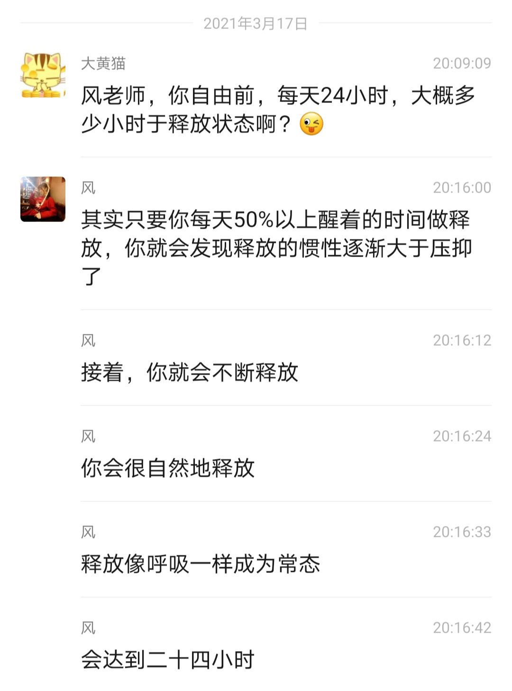
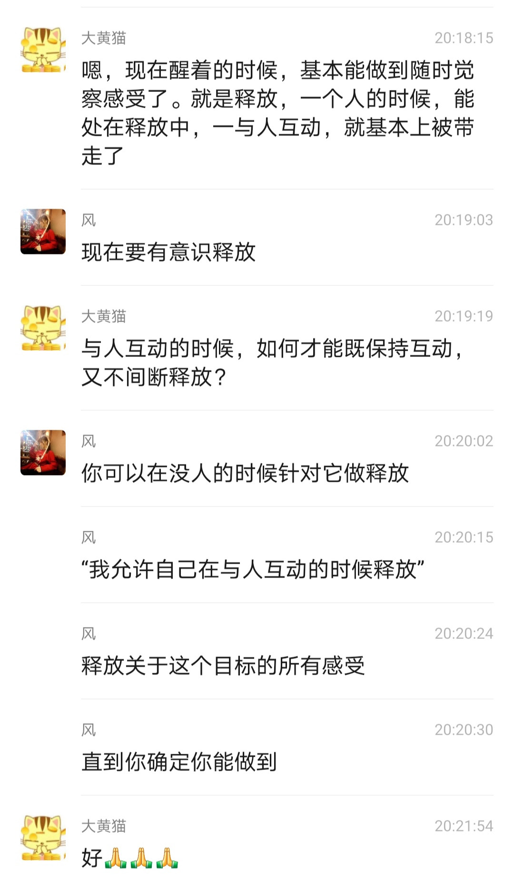
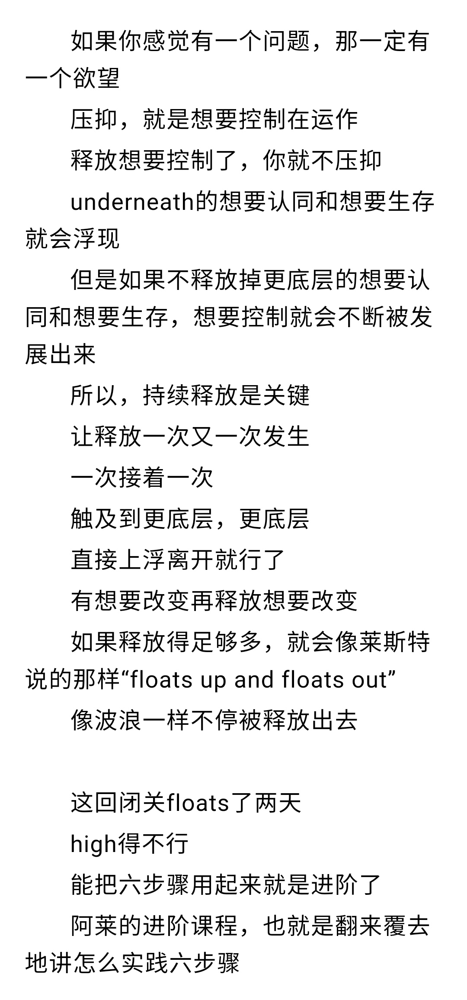
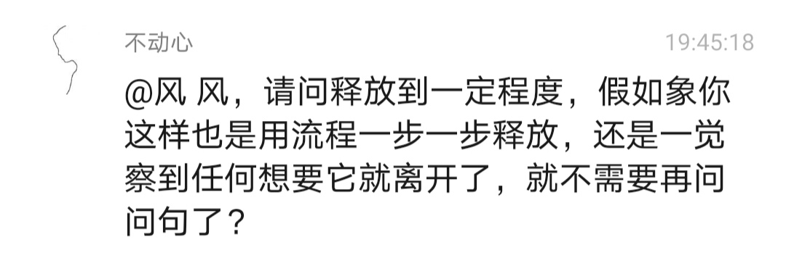
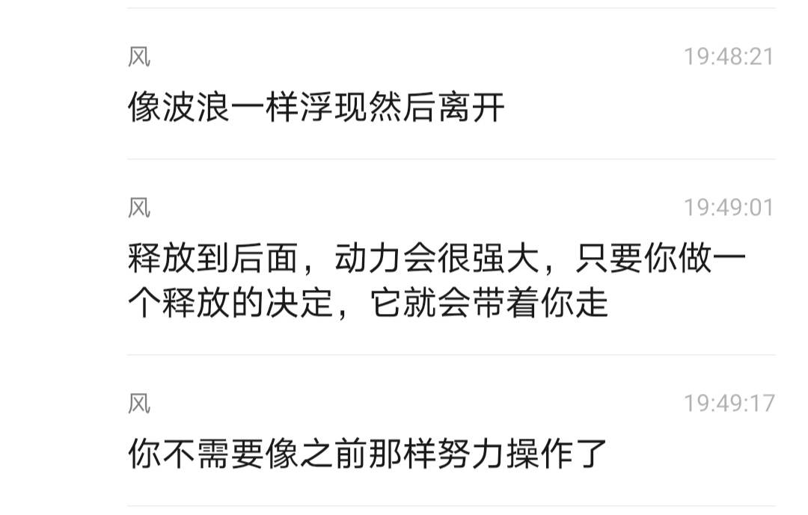
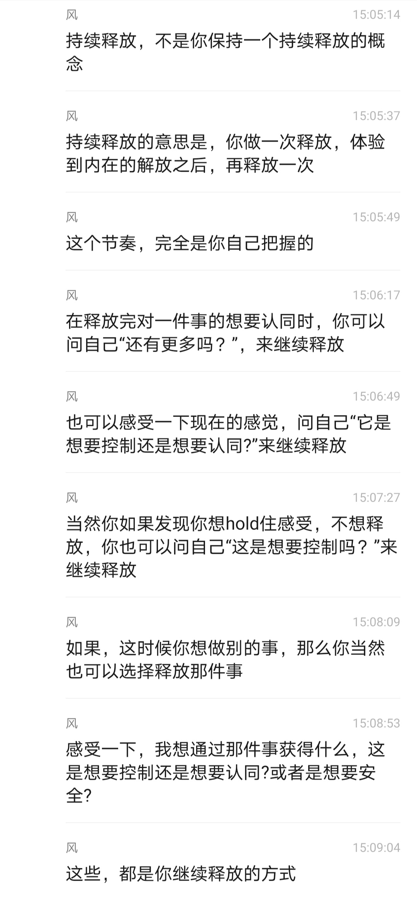

# 风谈六步骤 Step 4

第四步: 持续释放。
Make release constant.

## 【2020.10.18 持续释放，没有停止】

风：第四步，就是持续释放。持续的意思就是持续。你做第一次，然后能做第二次、第三次、第四次……直到最后一次达到自由。

莱斯特说“there is no stop in the six steps”, 并没有一个“停止”在六步骤里面。持续的意思就是持续。

## 【2020.10.24 持续释放，让它成为像呼吸般的常态】

风：我解释一下第四步，make release constant。

因为你们直到现在为止，压抑才是常态。
 

所以你们会问“这个需要释放吗？那个需要释放吗？” 你需要问“我需要呼吸吗？”这样的问题吗？你为什么不问“这个我需要压抑吗？”

因为压抑是你的常态，释放反而成为了你的变态。你需要让释放成为每时每刻的常态，就像呼吸一样。

呼吸一开始也不是自动进行的，包括你身体的五脏， 起初你都是有意识运作，随后才交给程序自动运作。

不一定要什么事都不干，但是释放不能停下来。一旦停下来一次，就像飞机助跑停下来，你需要再次让它跑起来。

莱斯特说的，让释放成为常态，让它变成你的新习惯
（make release constant,let it become your new habit.）

你先把所有能够释放的时间拿来释放吧，接着，你就发现你不需要“做什么”，事情会自然发生。你看着身体移动，因此你能一直释放，而不需要分心去操作身体做事。

释放，就是让感受浮现离开。释放一次，有新的感受涌现出来，你接着释放第二次，这叫持续释放。如果你此时没有让感受离开，而是把它压下去，这叫停下来，这点很简单。

有没有在持续释放，你自己就能知道。
 

## 【2020.11.28 释放一次一次又一次，整天不间断地让感受浮起浮出】

风：所谓持续释放，就是你释放了一次，再释放一次， 然后再释放一次。卡住也是一样，每一次卡住，你都想要控制，你就释放想要控制。把每一次卡住当成第一次卡住来释放。

如果你真的这样持续释放，到达一个阶段，当你 50% 以上的时间都用来释放，你会发现它超过了压抑的习惯。

当它成为你新的习惯，你就会发现释放和呼吸一样自然。这个和呼吸一样自然仅仅是比喻，并非让你随着呼吸释放。

莱斯特有描述：即使你与他人在一起，你也可以一直，整天不间断地持续释放。你们可能都经历过（感受）不断的浮起浮出，浮起浮出的状态（You've probably experienced the state where it
comes up and floats out, comes up and floats out.）。必须达到， 做到这一点。

真的，有太多的“垃圾”了。偶尔的释放也会有所效益。但是， 如果你想将其全部释放掉，大量的释放，持续的释放，看看六步骤吧。你必须让释放保持持续。整天都不断地让（感受）上浮起，排出去。 你觉察到某种感觉并将它释放。这有点像你坐着观看到它，看它不断 进行着。

浮出来，浮出去（comes up and floats up）。浮出来，浮出去，不会停下来。
 

## 【2020.10.23 释放感受，再接着释放感受，当释放感受成为常态，感受就会像波浪一般不断浮现并离开】

在焉： 风，你平时释放就像呼吸一样，还用问自己“能让它离 开”这样的问题 吗？还是直接释 放？ 你平时的释放是像一直在放松的状态一样吗？

风： 在第二个星期的时候，感受就会不断浮现出来， 然后离开，像波浪一样。

但是当我停下来时，瞥一眼六步骤，立即就会知道自己哪一步有问题，于是释放就又立即进行了。流程并没有改变，只是它变得更直接了，操作更少了。

我感到自己一直在六步骤上，而这六步骤形成一个巨大的推动力，让释放持续下去。领悟频繁发生，这时候你会被它们带着走，但只要继续提醒自己六步骤，就会继续释放，达到更高的高峰。

Susan: 不需要特定想起某事来激发情绪吗？

风：不需要。六步骤里面没有的，都不需要。注意到第三步是 " 所有感受都是想要控制和认同，释放它们 "， 所有感受的意思就是所有感受。你现在一定有感受，它一定是想要控制和认同，你就一定可以释放它们。

任何时候你都可以用这个方法，很简单，进入六步骤。
 

第三步，此刻你的感受是想要控制还是想要认同？释放它们。第四步，持续释放，让它成为常态。

当你释放一次，你的感受上升了，这时候涌现出新的感受，它还是一种感受吗？

当然还是。

它还是想要控制和认同吗？ 当然也还是。
因此，你可以继续释放下去。

再释放，你的感受再次上升。涌现出的感受依然是想要控制和认同，你依然可以再次用流程释放，就是这样简单。
 

 

——风	2020.10.8

 

## 【2020.1.3 当释放的习惯大于压抑的习惯，持续释放就会发生】

文兰： 一秒释放一次时，或者是自动释放时，是不是只要是感受就自动释放了，不会去区分是认同还是控制了。

风：识别出来它就释放了。有时候它发生得很快，你的心智还来不及理解。持续释放时，感受如同波浪式地涌出，你只是看着它排出去。

刚开始，你压抑的习惯大于释放的习惯，需要一次次操作流程。当你让释放成为常态之后，持续释放就会发生。

## 【2020.10.23 持续释放的重要性就如同飞机起飞】
朝颜：风，你这两周释放的量有没有超过你这两年的啊。风：不是量的问题，是惯性的问题。释放就像飞机助跑，
如果你跑跑停停，就永远飞不起来。只有你一路往前冲， 才能加速到飞起来的程度。
 

2020.10.22

 

## 【2020.10.11 一开始压抑感受是习惯，觉察到每时每刻的想要，不断释放就能解除压抑感受的习惯，释放就成为你的惯性，释放就成了常态】

慧轩：是不是根本来不及感受情绪，情绪就被放掉了？

风：差不多就是这样，欲望是一碰就走。随着释放加速， 会感到以前的高点，实际上非常低，欲望会一下子觉察到。

慧轩：情绪放没了，信念没了，就是空了。无欲无求， 人生就真没意思啦，小我什么都不要。

风：这个不能用头脑想象。我是想一口气释放到底的， 但现在实在是坐不住，刚刚去大桥上跑了一圈，多余的精力太多了，这应该是释放带来的巨大能量。我到后两天才明白持续释放是什么意思。基本上每一次释放就会带来一次很充沛的能量释出。

巨廷： 你是在释放自己生命中所有不和谐能量吗？还是针对某些人事物，具体的事件？

风： 三大欲望。因为你时时刻刻都活在想要里，放完了又来一个，放完了一个又来一个。

文敏：心里十分羡慕风，我也想到达那个阶段。风：方法用对了就行。
 

ZOEY： 释放后，被外界激发情绪欲望的频率、强度有变化吗？

风：不是这么讲，我跑完回去再细说吧。

（后来风继续讲）

风： 这个问题是这样的。认同和控制就是世界 , 对世界有强烈的贪恋和厌恶。

它时时刻刻都发生，我就在这些想要中，就像鱼儿在水中一样。但如果你决定持续释放，你来一个放走一个， 很快你会发现你身处于这个欲望大海中。

如果你持续释放几天，你就会非常非常宁静。在这个宁静之下，有很多强烈的欲望会很明显地浮现出来。被觉察到时，它只是一下子被释放。

释放成为常态，是因为你发现了你把它压抑在下面是不自然的，一直在无意识压住它。而这是一个根深蒂固的强有力的习惯，当释放了足够多的想要控制，这个习惯也就随之失去力量，越倾向于自然地释放。

释放到一个点的时候，有那么一刻，突然感觉到身体不是我。它只是在动作，但是却没有一个自我在里面运作。但这个对身体的认同马上就又回来了，与此同时，我察觉到那是想要控制，这个想要控制就被释放了。下面的经验
 

我的直觉告诉我不适合讲出来，我继续释放去了。

倚天：看来到了高级阶段，的确是一觉察到就释放了， 但为什么初级阶段虽然觉察到了却不能即刻释放，还要反复操作问句呢？

风： 就像我刚刚说的那个比喻：游鱼习惯了大海，会觉察不到自己在水中。因为压抑的习惯是一种强烈的倾向， 所以要不断地通过问句有意识的觉察、以及做出释放的决定。

但当你走到一个点，这个根深蒂固的习惯已经被释放掉，那么释放这个自然的倾向本身就成为你的习惯。这时候，你就很容易让释放成为常态，make it constant。

用莱斯特的话来说，观看那些限制浮上来，然后浮出去
（you just watch it floats up and floats out）。

但是达到那个习惯被扭转的点之前，你必须有意识去做， 否则会被习惯支配，这就是流程的重要性。释放欲望的流程大概就是这样操作的。
 

## 【2020.10.14 风分享自己持续释放的体验 】

风：我持续释放这几天，有一些体验，我前两天没有分享出来，因为这可能是施加影响，我现在谈论一些，希望能鼓舞到你们。

这是我和一个朋友的聊天，我把他的部分去掉了。

（以下是风分享的和朋友间 10.12-13 的聊天记录）

【2020.10.12】这几天持续释放中，我体验到一些东西，持续释放确实有强烈的能量释出，而且确实有两次脱离身体中心。我昨晚实在坐不住了，去大桥上跑了几圈， 第三天我就没有睡觉了。大概在第二天晚上的时候，有点困倦涌上，然后我释放了想要控制，一种莫名的精力涌上来。

持续释放威力非常大，自由真的是要体验的，所以我分享一下我这几天的经验，有点惊人，所以我没有在群里施加影响，你想听听看吗？

昨天我有一次释放的时候，感觉从身体里 " 掉出去了"， 这是在能量不停涌现的时候。一开始我迈动身体，我发现平时我都用想要控制来走路。也就是说我消耗了一部分精力去控制我的身体移动。这个被觉察到的时候迅速被释放了。
 

接着我突然视角转变了。

身体自动走路，手臂和大腿自动 " 漂 " 着走。而我不知道在哪里看着它。这个视角持续了大概两分钟。我首先是发现，每次我移动身体都是费精力的，也就是我每次动作实际上都有想要控制，然后我觉察到的那一刻它就被释放了，这是在持续释放了好几天之后发生的。随后我领悟到为什么每次释放都会带来巨大的能量。因为实际上我一直在用这个能量来压抑自己，这个就是我自己的想要控制造成的。

不过很快，我突然意识到这是一个很大的 " 领悟 "， 因此就想要保持这个 " 状态 "。我一想要保持，就从这个状态中掉出来了，所以只是持续了两分钟。不过这个体验给了我很大鼓舞，我释放的动力更足了。

我分享这个体验，希望也能给你一点鼓舞。（笑）加油。

【2020.10.13】我发现，当你释放得很 high 的时候， 阻力的形式就会变化。虽然释放变得很容易，但是缺乏动力。经常会待在一个很好的状态中享受。释放两三次就自发停了下来。要不断提醒自己，才能继续释放。我要想到better 这个词，前面有更好的，不要止步于此。

前两天，我释放了一次对死亡的恐惧，我发现正如莱斯特所言，当死亡的恐惧被释放时，想要认同和控制也大量消散。同时我看到这个世界是怎样构建的 , 譬如我们的道
 

德观，我们的高尚与卑劣 , 它最终是为了维持身体的生存。

在我们的世界中，为了别人的生存而牺牲，为什么会被认为是高尚的事？因为我们潜意识把身体生存这件事看作是最重要的 , 因此会认同那些为了大众的生存牺牲的人。整个世界，它仅仅是生存程序，它等同于控制和认同。

嗯 ，理论上很早就知道，但看到时还是很震撼。比如说我抬头看到天花板，天花板居然是想要控制和认同， 很神奇。因为我对它有感觉，感觉就是想要控制和认同。除了我的感觉外，世界并没有其他东西，nothing out there。

第一步的想要自由，可以被有意识增加，只要提醒自己就行，但不提醒就会忘记，很容易忘记。很多人会觉得为什么这么简单的六步骤要写下来，还有 get everything by releasing only，为什么要写下来，放在显眼的地方，因为真的很容易忘记。而且，你本来就有无限能量。

昨天还有一个事，我在天桥上跑到桥尾，一路跑到下面，没注意到前面停着一辆车。这时候浑身精力非常充沛， 我伸手一推，那辆车竟然被横着移动了一米，我没有感觉到累，回到家过了很久，这种浑身能量充沛的感觉才慢慢平稳下来。

这和那种 watch it happen 的感觉还不一样，因为持
 

续释放确实会像莱斯特说的那样，身体会释出很强大的能量。它会让身体受不了，所以会出去活动。在活动的时候， 我只是宣泄多余的能量，而我昨天大概知道这些能量是怎么来的了，它一直都在，只是我平常用来压抑自己的感受。不用来压抑感受时，它就趋向于无限。

我那一推的力量，应该比现在世界上力量最大的大力士还大，但我的身材很小，没有肌肉，我们被身体限制得真的很严重。莱斯特还说过，站在核爆中央，只要你不抵抗， 就一点事都没有。不过，热能我体会到了，不抵抗 heat， 确实不会热，这个简单些，可以试试。

加油，make it constant，你不一定需要专门抽时间去做，而是把所有时间都拿来释放，嗯，就是说，其实没有必要等待一个闭关独处的机会，现在能够感觉到感受， 就可以释放。我们时时刻刻都活在想要里，就像鱼儿活在水中，觉察到想要控制和想要被认同，它立即被释放了， focus on these two wants，这样做会容易很多。
 

## 【2020.10.14 持续释放几天的效果远大于断断续续多年 】

我是无限： 你是释放想要控制，但是我释放的都是想要改变，想要控制很少，我觉得想要控制是一大堆想要改变组成的，你怎么看？

风：课程是想要控制，莱斯特说话时经常用想要改变。

想要改变、想要推开它、想要抓住它，这都是想要控制。想要改变是想要控制的一种。

如果要说的针对性一点，那就说想要改变。有时候我们想要改变，有时候我们想要维持，这都是 wanting of control。

我是无限：对，你这个说得非常好。

风： 我断断续续使用释放法六年，没有持续几天的效果好（笑），持续多么重要。

我是无限： 对，持续释放会不断深入，间断的释放就不行。

风： 我体会到莱斯特在视频里说的，帮助他人就是帮助自己，前段时间我翻译莱斯特的音频和 92 年释放法课程， 在翻译的过程中，我等于自己又复习了一遍，而且这回发现了我听很多遍都没有注意的问题，这让我得以持续释放下去。
 

我是无限：你持续释放到死亡恐惧的过程是怎么样的？ 大概的方法和流程？

风： 方法很简单，把六步骤放在身边，我现在的感受是什么，想要控制还是想要认同？能觉察到吗？它离开了吗？还能觉察到更多想要控制或者想要认同吗？能够让它离开吗？我用的就是 92 年释放法释放欲望的流程。

每一次释放，会去看到一点自由，然后我会提醒自己第四步，持续释放。持续释放的方法，就是继续去看现在我是想要控制还是想要认同。如果我对此感到模糊，马上我就能感觉到我是想要改变这个状况，而这是想要控制。觉察到它，立即就有放它离开的倾向。

中途，当然有很多让我停下来（卡住）的状况发生。注意到，提醒自己第四步（持续释放）。

发现自己用力、努力、胶着，则提醒自己第五步（释放想要改变）。

到后来，有强烈的喜悦涌现出来时，没有动力释放， 提醒自己第一步（我想要的是自由）。

不知道释放什么时，提醒自己第三步（所有感受都是想要控制、认同）。

每当这时，都会立即察觉到这个想要控制或者认同，
 

欲望会来一个放走一个，来一个放走一个，对死亡的恐惧
（想要生存）就如莱斯特所言，自发地浮现到表面来。

第一次释放对死亡的恐惧是最困难的，对死亡的恐惧第一次浮现时，就像是手碰到了滚烫的火一样，立即缩回去，我反反复复释放了想要控制，然后再去触碰它时，释放了一次，后面就简单了，逃避的倾向太强烈，所以我们倾向于把对死亡的恐惧压抑在最深处。每一次释放对死亡的恐惧（想要生存 )，都会削弱这个逃避的习惯。

我还是先做到最后，再来分享吧，我去释放了，各位加油，回见！（笑）
 

## 【2020.10.30 风分享持续释放后身体和生活的变化】

起初的时候，我是通过释放来做到所有事。后来我清理了大部分都想要控制和认同，我开始专注于对死亡的恐惧， 于是我释放了很多对死亡的恐惧，一种难以言喻的安全就这样笼罩着我。

这时候我只要有一个念头，事情就会发生，甚至不需要刻意对它做释放。

几个星期的释放，你就可以做到这些事。

还有我实际上已经不需要睡眠和食物。我现在不需要睡觉，旺盛到甚至要到天桥上跑一圈宣泄。

我从第一次闭关，释放的第一个星期就开始了。只要你持续释放想要控制和认同，身体就会涌现出无穷的精力。这些能量的涌现甚至会让身体会承受不住，所以需要出去跑几圈宣泄。（笑）

那时候你自然就停止了睡眠。你不需要刻意去抵触睡眠，只要在你清醒的时候都用来释放就好了。

嗯，如果你没有疲累，那就释放下去，一次接着一次。如果你感到疲劳了，睡觉是不影响释放的。

我只是说明这一点，把清醒的时候都拿来做，你会进展得很快速。我依稀记得莱斯特在一个音频里讲过，如果你
 

睡觉之前在做释放，你到了梦里，星光层面依然在做释放。

所以，你可以睡觉，你没有必要刻意撑着不睡。等你释放到精力无穷时，你会自然停止睡眠。这说的足够清晰吗？
（笑）

去吧，祝你成功。（笑）

是的，为什么不把这个方法用到极致呢？它能给你带来更巨大的好处。
 

## 【2020.11.7 仅仅一个念头事情就发生】

伯利恒之星：这几天进步很大吧。（笑）

风：你体验过平静吗？是一种时间寂止的感觉。我刚刚看情绪表平静的描述词，无限、永不衰老、不朽，就是这种感觉。

伯利恒之星：还没有（笑）。只体验过几秒钟失去对死亡的恐惧。

风：以前我把万念俱灰当平静是很错误的。伯利恒之星：哈哈哈，我好多年都是。
风：你体验到波澜不惊了？

伯利恒之星：几秒钟，没有完全波澜不惊，一个预览， 然后就掉到底下来了。

风：那应该是一个很大的鼓舞。（笑）

伯利恒之星：有一点，我每天都记着那种感受。

风：我连续住了很多五星级酒店没有花钱。

伯利恒之星：哈哈哈，跟莱斯特一样了。那可算是一个巨大的成功经验。

风：其实这不是这次的成功经验，上次我已经不再收钱， 也不再工作了，因为我强烈地感到自己不需要钱了，于是真的就不需要钱了。

伯利恒之星：现在你依然可以做到吧。

风：嗯，我从上次以来，一直在体验莱斯特说的一个念头事情发生。这成为了一个惯常经验，所以我没有特意强调。

（注：风在此次谈话中另外提到一些超体验的事情，与莱斯特曾经讲过的相似。因为不适合放在公开传播的册子里，故隐去了一些对话，只摘选部分。风亲证了莱斯特所说的“仅凭一个念头，事情就毫不费力地发生”，让我们自己也通过持续释放，达到这种状态吧。）
 

> 而事实上我在问，那么我们为什么不走完全程并得到完美的自由，好让我们不再有烦恼，不再有痛苦，在那里我们可以仅凭一个念头得到一切。 
有一天我们会这样做的，我们中的每一个人。为什么现在不这样做呢？
> 
——莱斯特

 
>任何事情的发生都毫不费力，只是把一个念头放到我们平静的头脑中，它会很快显化出来。那为什么不在接下来的几个月里做到呢？ 
聪明点。
> 
——莱斯特

 

## 【2020.11.24 持续释放是靠六步骤达成的，不是靠外在的行动，不是靠闭关，关手机 】
Go All The Way: 我这两天还是无法持续释放，而且第一天闭关时特别想睡觉。

风：所以我不推荐别人闭关。（笑）

Go All The Way: 一释放就睡觉，不释放也想睡觉， 根本没办法释放。

风：把自己关起来用处不是特别大，业力是无法被关起来的。

Go All The Way: 我没有关起来。我照常做事，只是没看手机，不看群，结果特别困。这就是我的闭关，第二天好一点了。

风：但是释放效率也没有达到自己想要的标准吧。

Go All The Way: 是的，完全回不到上次我持续释放一天的突破状态，一直就卡。

风：持续释放是靠六步骤达成的，不是靠外在的行动， 不是靠闭关，关手机。（笑）进入六步骤，聊着天也能持续释放。

Go All The Way: 是啊，上次就是聊天也释放了一天，
 

现在释放十分钟都不行，好像突然间不会释放了。

风：回到六步骤就好。其实我不推荐闭关，除非你释放到自然倾向与外界断联系。

Go All The Way: 我以为是手机分散了我的注意力， 让我不愿意释放。

风： 不是的，是你的 karma（ 笑），是你的程序让你不释放。负起全责，不要赖手机。

Go All The Way: 我以为断网会让我持续释放。

风：这是很多人的误解。向外找原因，比如有人以为是工作拖住自己；有人以为要不是现在的状况，自己早就自由了；有人以为家人拖住自己……实际上都不是，能拖住自己的只有自己，take full responsibility。
Go All The Way: 我逼自己不看手机 ，这样就可以专心释放了，结果手机确实没影响了，但是我还是不愿意释放。所以根本不是手机的事，我就是不死心啊，以为外在的东西能影响我释放。

风：释放就好了，别管闭关还是聊天。外在的东西要是能让人达成六步骤，圣人就可以批量生产了。把人全部关起来，逼他们释放。（笑）
 

## 【当你持续释放，你会自动隔离；当你决心向内，没有任何人事物能打扰你】

【2020.10.23】

风：当你持续释放，你会自动地隔离。

六步骤没有叫你辞职，也没有叫你隔离，它只是叫你持续释放，当你持续释放，隔离会自动发生。

持续释放不需要依赖一个安静的环境，因为你的世界仅仅是你思想的投射，你无法通过对一个结果做些什么来改变起因。如果你感到嘈杂，那只是一个感受，你回到第三步，释放你现在的想要控制和认同的感受。

一开始你会感到困难，所以你可以把你所有不需要脑力工作的时间先运用起来。当你这样做，持续释放会产生一个动能，它会让你的释放发生得越来越简单，这时候你就可以在做事时也能释放。

再接着释放下去，你会发现自己不用做事了，因为你不再创造那个图景了。你不再创造 " 我需要工作 " 的图景了。
 

【2021.1.7】

倚天：“当你持续释放，你会自动隔离”，是说进入持续释放后，自然不会有人打扰吗？

风: 
当然 , 外面的世界本来就是你投射的 , 如果你被打扰，只能说明你想要被打扰。你用思想创造了那个被打扰的境况。

倚天：你在闭关时，没遇到任何打扰吗？

风：没有，一旦你决心向内，没有什么能打扰你。

倚天： 是外在有刺激，自己没有反应？还是说外面自然真的什么干扰都没有了？

风： 一回事。外面只有你的思想，一开始你还在创造一些事件，不过那是你的欲望在打扰自己。

释放到后面，尤其是集中释放死亡的恐惧的时候，想要控制和认同走得差不多了，世界完全不会干扰。如果在树林里这会更明显，毒蛇猛兽都会离你很远。

倚天： 比如，你在关房里，有人敲门，但对你根本不构成影响。还是说，一旦你进入持续释放，根本不会有人来敲门？

风： 释放了足够多的想要控制和认同，根本不会有人敲门。

倚天：我知道了。
 

## 【2020.10.30 不要找机会让自己停下来 】

风：不要找机会让自己停下来，释放的感觉不美妙吗？

## 【2020.12.28 继续继续继续 】

风：到达更轻松后，应该继续释放。一次性把底层感受清空。

>不要找机会让自己停下来  
到达更轻松后，应该继续释放 
一次性把底层感受清空
> 
 ——风

 

## 【不论是否定目标，只要能一直持续释放，有释放的动力就可以】

【2020.3.16】

天成： 老师，我刚刚写下来很多想要的目标，也定了时间。在过程中，是不是只要我持续释放，也不用一直盯着目标，只是去贯彻六步骤，也可以达成？

风：可以。

【2021.7.26】

安心自在： 一定要列目标释放还是说也可以只释放当下的感受也可以？

风：it's up to you。释放，一定要按照自己内在的节奏来。

 
