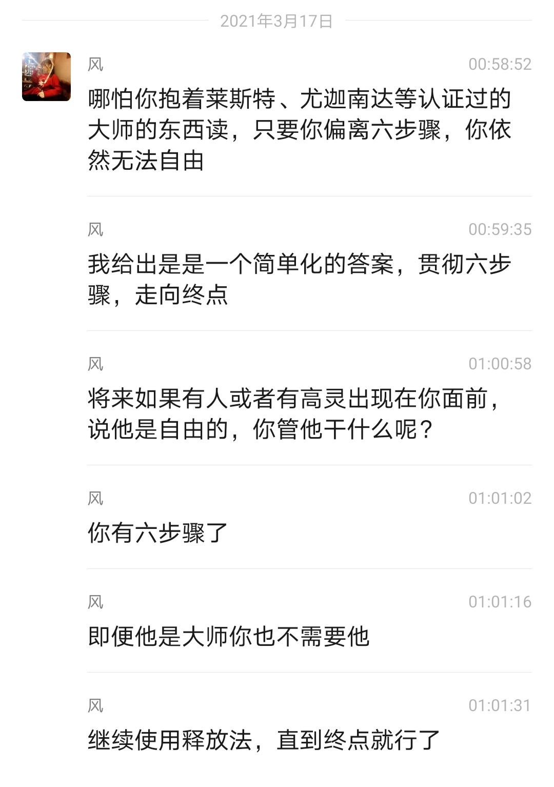

# ∞附录二 风：六步骤以外，不需要任何别的东西。无论发生什么也只是六步骤

感谢天成整理分享

## 对话一：成功之道——六步骤

问: 
老师，可以说说你的成功之道吗？ 

风: 
六步骤。

问: 
为什么你可以做到？而那么多人做不到。

风: 
六步骤。因为你需要别的，而我只需要六步骤。

问: 
所以，必须要在行动中做。

风: 
关键是你没去做。没过多久，你又想到一个心智的问题，于是开始研究起来，就像这个问题一样。

六步骤里面没有矛盾，但如果你去抠莱斯特的文字， 用你的心智加以曲解加工，你总能找到所谓的“矛盾”。它会立即让你走向限制的方向。
 

那些心智问题，那些偏离六步骤的内容，就会让你偏离自由。

我是一个智性很强的大脑，但我正确地运用了我的智性，也就是，认识到心智的限制。

在整个过程中，我只看六步骤。我不需要六步骤以外的任何东西。如果要说成功秘诀的话，这就是秘诀了。

不停搜集资料的人是达不到终点的，尤其是他们的智性头脑还分辨不了那些内容。

问: 
那我该如何做才能到达终点？ 

风: 
六步骤。
 

## 对话二：在所有的帮助中，没有比毁掉支柱更好的帮助

问: 
老师，这次你真的是彻底离开吗？ 

风: 
嗯。我会离开世界。

问: 
直接融入无限？

风: 
不是。不再与人交流。人们所说的 isolation。

问: 
这是你的内在指引吗？

风: 
嗯，当我决定了，我就去这样做了。

问: 
老师，为什么不能继续帮助我们呢？

风: 
离开才是帮助。我看得到全景。如果我待在这里， 不会有任何人自由。依赖关系对成长而言是致命的。

问: 
但在我需要你的时候，你可以来帮我吗？

风: 
彻底离开就是帮助。一个无限存在需要帮助吗？ 当你向外寻求帮助的时候，那是一个机会，觉察到它，释放。

向内找到你想要的一切，绝对的安全感只有在你的无限存在里才有。

在所有的帮助中，没有比毁掉你的所有支柱更好的帮助。

（风下面引用了一段《我和莱斯特》书中的话）
 

莱斯特告诉我世界会“击垮他的支柱”，所以每个人都会被迫从内在寻找答案。

“那很好”，他说。

“不是爆炸，而是扬升”，他笑道。

目前，人们总是用世界提供的各种逃避方式在外界寻求快乐。最终当外界的逃避没完没了时，他预言，我们就会被迫进驻到内在。

“这真是件好事”，他说，“因为人们会被迫找到答案，知道他们真正是谁，就像我一样。”他总是对我说他特别感谢他的心脏病。

风: 
当外界的逃避方式都被击垮，你会被迫进入内在， 但你可以变得更有意识，更主动一些，不要等枪顶着脑门再去做。

你们都非常清楚自己，尽管不是那么深入，但是会知道自己的行为，有依赖你就会抓着。你依赖外界，就发现不了内在的无限。这些东西都很简单。

释放法作为自立的方法，并没有那么多问题。所有的问题，都是在你偏离六步骤时产生的，因此，要么你回到六步骤上继续释放，要么你走向限制。
 

我作为一个获得终极自由的人，是不能在这里的。

问: 
为什么终极自由的人不能在这里？

风: 
莱斯特待在这里几十年，都是在重复这些，用他自己的话来说，“over and over and over and over again”，他不断重复讲同样的东西。

他走之前一年，和他的一位学生说，我不能待在这里了，我在这里，你们只会依赖我，没有人会自由的。

因为他们认为莱斯特在这里，可以指导他们，因此就不断忘记。莱斯特离开之后，过了没多久，Sedona institute 那位女士就获得了自由。

我和莱斯特聊到很多他过去的事情，他在世的时候， 没有人在他的指导下获得自由。

问: 
你和莱斯特聊天啦？ 

风: 
我经常和莱斯特聊天。

问: 
这位自由的大师是释放法教师还是学生来的？

风: 
学生。没有释放法教师获得自由。而且莱斯特指定的释放法教师大部分是他觉得倾向不那么好的，也就是更倾向于世界的。

问: 
你们是怎么聊的呀？
 

风: 
自由的人之间不需要任何媒介沟通。存在于每一个点。我们之间并没有分离。

问: 
我现在没有做释放法教师的想法了。

风: 
你未来或许会有，除非你释放了那些程序的驱动。如果你不释放，它就会不断驱动你去整活。

所有的精彩，所有的创造力，都来自无限存在。心智是机械化的程序，只会重复。或许可以这样说，一个从心智程序中自由的人，才真正开始活着，此前只是被不断驱动的机器人。

问: 
昨天有位朋友找我，交流释放法内容后，他给我发了一些金钱，这次我拒绝了哪怕现在还挺穷。因为我不想用释放法来收费。

风 :well，用这个赚钱会给你一个错误的反馈。用谈论释放法来代替实际去释放。这些是很容易让人偏离的。

此外，灵性书籍也最容易让人偏离，因为阅读那些书籍时，人们会骗自己在路上。当你偏离时，如果你知道自己在偏离，那就可以转回来。

所以，你不需要六步骤以外的东西。the way 是好的， 那些大师的书也是好的。终极自由之路，也是好的。

但当阅读它们让你停止释放时，它们就不是好的。
 

Ralph 曾经拿着一本拉玛那马哈希的书，不断阅读，进行研究。

后来莱斯特说，你疯了，你本来可以释放的。莱斯特和我说，他无数次去试图纠正学生的倾向。

他的学生会想出很多逃避的方式，譬如询问“我是什么”，这是一个很高大上的逃避方式。

莱斯特在一段特定时期倡导过这个方法，但是，他们只是在逃避释放而已。

在这个法门还有可能成功的时代，他教导过。在 1970 年结束，已经不会再有人用这个方法成功了。

问: 
老师，你还有什么要和我说的吗？

风: 
其实上面的都不用说，说的越少越好。心智积累那些东西有用吗？为了达到自由，所有的积累都要被释放的。

就连克利亚南达尊者，都会被障碍，他逐字逐句地回忆尤迦南达的教导。这有用吗？这完全没有用。他为自己的上师写书和宣传，代替了实际去做。自由，要去做到才行。

问: 
实际上，克里亚南达尊者到达了哪里？

风: 
克利亚南达尊者到达了禅定的阶位，但没有到达三摩地。

问: 
所以还是会退转的？

风: 
嗯，只要你做不到，说再多都没有用。

问: 
尤迦南达大师有没有继续帮助他？

风: 
最好的帮助就是离开。

问: 
尤迦南达离开克里亚南达是最好的帮助？

风: 
尤迦南达只要在，他永远望着上师，永远把上师作为知识和力量的来源。而这是不可能自由的。任凭他怎么呼唤，尤迦南达也不会来。

要调转方向，必须让你在外在找不到安全感。当你在外在找不到一位大师，你才会在自己的内在找到。

问: 
你没有依赖上师，这是你成功的一个优势吗？

风: 
嗯。而且我从来没有想过呼唤莱斯特或者其他大师。我在学习大乘佛教时，就倾向禅宗而远离净土宗。那是我的优势，我只想要自己独行。

问: 
自立。

风: 
嗯，那是我很长时间以来的一个倾向。

问: 
之前在群里看你的分享还挺有用的。
 

风: 
当你觉得看什么东西有用，你就会不停去看它。回到六步骤的话，就会很简单。

但是看其他的文字，哪怕是大师的教导，哪怕是莱斯特本人的教导，都会让你的心智越来越复杂化，因为心智倾向于复杂化。

你还喜欢戒禁取，摩西和耶稣教导中所禁止的偶像崇拜，佛陀把一类行为称之为戒禁取，即认为祭祀等活动有益于解脱。

其实，没有用。你那些整理大师照片的行为，统统没有用。相反，这是基于一种邪见，戒禁取见。

你认为和那些外在的形象和仪式相关的事情有帮助， 当你这样做时，你加深了这种见解，也就远离了只有在内在才能找到的无限存在。

你认识了大师，却仍以世俗的迷信方式对待他们。

问: 
是的，我不得不承认。那我该怎么办？

风: 
怎么办？解决方法只有一个。六步骤。释放。如果我说还有第二条解决方法，你就不会去释放。

问: 
老师，我还有什么错误都请你说出来

风: 
你现在就在犯错，因为你没有释放，没有在释放
 

就是错误。任何时间，任何地点，没有在释放就是错误， 哪怕你是在听我讲话。

问: 
老师，你在离开前可以给我留一封信吗？ 

风: 
不会。六步骤。贯彻六步骤，走向终点。
希望在我离开之后，你不要再依赖那些文字或者其他的什么，而是直接走向终点。

again，六步骤以外，不需要任何别的东西。无论发生什么也只是六步骤。
 

## 对话三：积累概念性的东西只会让你无意识偏离自由的道路，看资料带来的清明比不上释放带来的清明

2020.3.17

大黄猫 : 风老师，可以这么说么，朗读和看书，都是逃避释放？

风: 
是的。而且看灵性相关的书尤其有一个坏的作用。

天成：老师，有什么坏的作用？

风： 因为它用谈论自由代替了真正去自由。在你看电影看小说的时候，你知道自己在反方向，你是有意识的。但当你看灵性书籍的时候，你自以为自己在路上，这种偏离是无意识的。这就是坏的作用。

另一点就是，积累那些你还没体验过的境界的知识， 会让你产生许多错误的想象。那些想象事实上并不会帮助你抵达那一状态，反而会阻碍，或者让你的心智把并非是那个的状态的东西当成那一状态。

（ 风接下来引用了《莱斯特对释放法的一些说明》中的一些话）

你在心智中发展的任何东西都会阻止你达到顶端。心智是你最大的敌人。
 

全部的这些痛苦都没有任何意义，我已经受够了，我结束了它们。我将全力保持在这种状态。

这需要花一个月时间，也许两个月时间，你就会释放掉所有的 agflap。但总而言之，我认为我们有这个释放心智的唯一的方法，通过使潜意识程序展现出来，能够让心智静止。

我们首先进入表意识，释放控制、认同。而其他那些你试图去释放的，像恐惧——你知道的，你会花上成百上千世去释放恐惧，在此之后你还会有愤怒，你还会有其他的情绪。而当你释放掉了想要控制，在它之下的东西就全部都被放走了。

然后当你释放掉想要安全，你释放了所有的想要认同和控制，以及在它们之下的一切。你现在太低谷了，因此不能向着想要安全发起进攻。你被压垮了、你被死亡给吓住了，于是让它运作着你。但当你释放相当数量的控制和认同，你就有能力去面对死亡的恐惧了。

但你们可以看到，我们的方法实际上是去释放心智的驱动。不要试图发展你的心智，这样你是在发展你的敌人， 发展束缚住你的东西。

大黄猫 : 风老师，整理你的资料，很受益啊，感觉更清明了啊。
 

风：那比不上释放带来的清明。

天成： 嗯，发展心智的任何东西都是障碍，甚至包括大师教导的内容。

大黄猫 : 风老师，这真的太颠覆信念了。我总觉得看风老师的资料和大师的资料，都是成长的台阶，了解这些理论，才能更好的释放。

风：那会让你自我感觉良好，但你没有释放。

（风接下来分享了两小段来自释放法纪录片《走完全程》里的视频）

Ralph 也遇到过完全相同的问题，那时候他是在研究拉玛那马哈希的书，包括冥想的问题也在上面。

释放法是最高效的方法，它不需要配合冥想、不需要配合仪式、不需要配合咒语、不需要偶像崇拜、不需要团体加持。事实上你用任何东西和释放法结合都只会削弱它的威力，使它的效果变慢。

仅仅用释放法来释放，贯彻六步骤。

大黄猫 : 风老师，在第二个视频里，“你完全在你的头脑里获得这些概念性的东西”， 当时我读到这里，还不是很理解。今天才知道，不去释放，头脑知道的再多，也没用。
 

 
