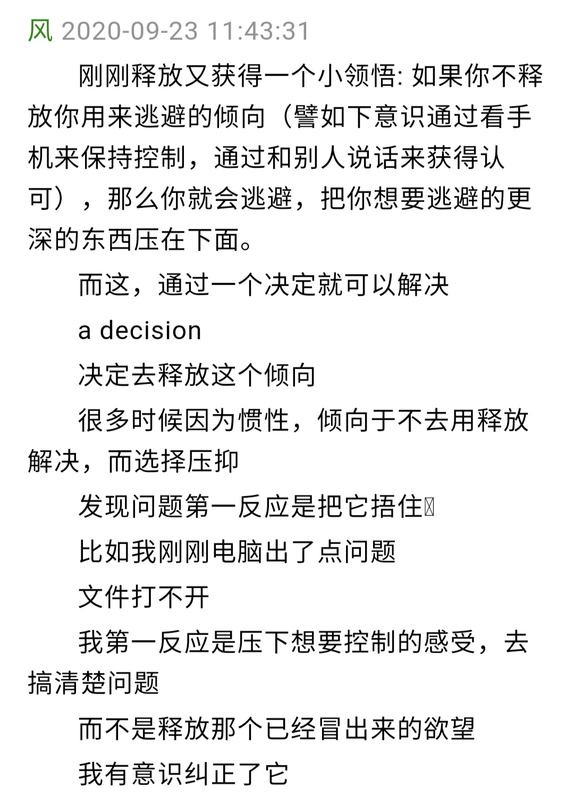

# 风谈六步骤 Step 2

第二步: 做出自由的决定。
Make the decision to go free.

## 【2020.10.23  真的决定了就会马上去做】

风：决定自由不是祈祷文，不是心理暗示，决定就是决定。就好像你现在决定从座位上走到门口。你决定了， 就会马上去做。

## 【2020.10.23  你的决定会带你去向想要的地方】

风：第一步是想要自由，第二步是决定自由。

如果你只是决定感觉好，或者达成某个物质目标，那么在你得到之后你就会停下来。

如果你决定自由，在你到达自由之前就不会停下来。

因为你想要的、决定的，你就会带自己到那里去。
 

## 【2020.10.24  决定通过释放来达到自由】

风：第二步只是决定，下决定自由，决定去用这个释放流程达到自由。

有的时候你踌躇不决，你会想“我要不要释放掉它呢？”，或者你想用别的方法，比如觉察，比如参问，只要你不决定去用释放流程做到自由，你会一直这样徘徊， 那么也就做不下去。

想要自由和决定自由，都是可以直接做的。

**just want it more，just make the decision.**

当一个想要控制或认同运作你的时候，你确定释放掉它会比它待在里面更好，它就会浮出来。

比如你现在想去玩游戏，那里面有个想要控制在运作你，你觉得释放掉这个想要控制比去控制更重要，你就达成了第一步，它就会浮现出来给你释放。

想要控制和认同= 想要世界，也就是往限制的方向走， 限制的方向没有自由可言。
 

 
 

## 【2021.1.2 每个人在每一刻都可以决定达到自由，这是完全的自由意志。只有一件事你有自由意志，那就是选择自由或者被束缚】

**兰若：** 
那莱斯特这一生的觉醒，也是预设的？

**风：** 
只有觉醒这一件事没法预设。其他所有事情，你都没有自由意志可言。

你只有一件事有自由意志，那就是选择认同你的身体或者无限存在。其他事情，任何事情，都没有自由意志。你的每一个想法都是被过去的程序推动的，包括你想要什么、厌恶什么，取决于你程序的倾向。

只有一件事，是完全的自由意志——那就是在任何时候，你都能认同你的无限存在。

释放，就是途径。

**FREE:** 
那我们遇到释放法应该也是预设？

**风：** 
当然是。如果没有非常非常好的业力，你不可能遇到释放法。抵达涅比卡帕三摩地，你的每一生就会浮现出来。随后认识到在每一件事中，都不是自己在行动，你一直是无限存在。这些后面的东西其实不需要说，我还是想强调六步骤，贯彻它。
 

彻底完成第一步的话，需要持续释放。六步骤都要注意。但如果你的意愿力量（will power）足够强大的话， 也能仅凭渴望一瞬间达成第一步。

每个人都可以自由，只要你去做。

如果你一开始走得很快，但中途停下来了，那你就无法自由。贯彻六步骤直到终点，贯彻是必须的。

**倚天：** 
决定自由就是决定释放，决定释放需要先看破头脑是自由的唯一障碍吗？

**风：** 
决定就是决定。你现在可以释放，也可以逃避情绪， 去玩手机，但是你决定释放。

当你达成第一步时，你只需要下一次决定：决定自由。不要用任何头脑的方式尝试突破，跟着视频练习。
我两年前曾经持续释放过一次，一个星期。当时，心智内的 agflap 清空得差不多了，接着处在一个非常舒适的状态，身边的世界也展现前所未有的和谐。

接着，整整半年一次释放也没有做，接着那些 agflap 就回来了，我甚至忘记了怎么释放情绪和欲望，持续地卡住，所以才进群交流。

后来我发现群里的人似乎不知道莱斯特后期音频和原
 

始版本的释放法的存在，于是就翻译了 the way 和 92 课程的两篇。

在翻译的过程中，我自己也温习了一遍，记起了其中的要点。于是我又开始持续释放，记着上次的教训，就一次往前走了。

在你到终点前，一定不要停下来。因为一旦你不在前进，就在后退。
因为你没完全释放掉想要控制和认同，以及死亡的恐惧，树根还没砍断，树枝和树叶会慢慢长出来。

没有所谓的静止不动，一旦你不在前进，你就在后退。

" 以后再做 "，这是个头脑的诡计，一旦用未来式，你的头脑会让它待在未来。

以后再做，意味着永远不会做。

这个时代只有非常少的人才趋向自由。
